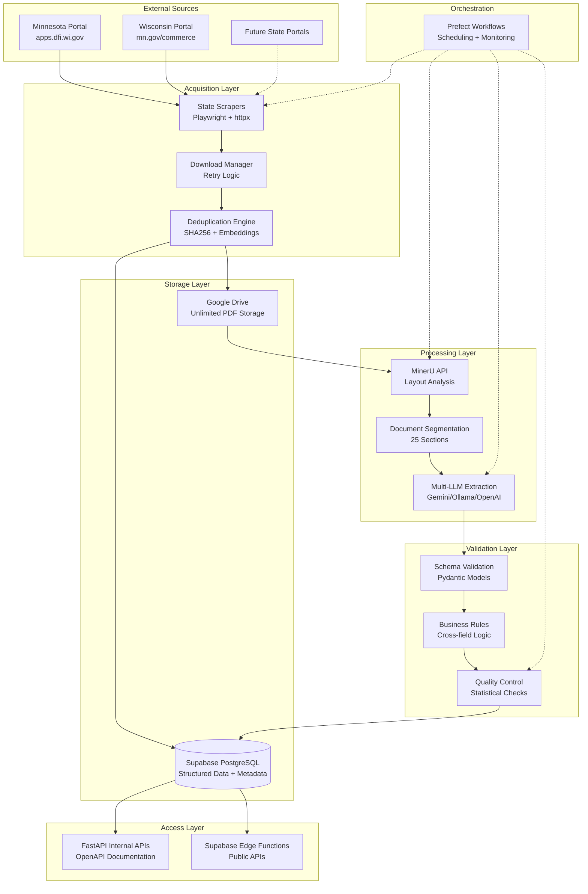

# FDD Pipeline System Design

## Overview

This design document outlines the comprehensive architecture for the FDD Pipeline system, building upon the detailed documentation in `/docs/01_architecture/`, `/docs/02_data_model/`, and related technical specifications. The system transforms unstructured Franchise Disclosure Documents into structured, queryable data through automated acquisition, AI-powered processing, and multi-tier validation.

## Architecture

### High-Level System Architecture

The FDD Pipeline follows a distributed, cloud-native architecture with clear separation of concerns across five main layers:



### Data Flow Architecture

Based on `docs/01_architecture/data_flow.md`, the system processes documents through five distinct stages:

1. **Acquisition Stage**: Web scraping with metadata extraction
2. **Registration Stage**: Deduplication and franchise matching
3. **Segmentation Stage**: MinerU processing and section splitting
4. **Extraction Stage**: LLM-powered structured data extraction
5. **Storage Stage**: Validation and database persistence

## Components and Interfaces

### 1. Web Scraping Components

**State Portal Scrapers**

- **Minnesota Scraper** (`flows/scrape_mn.py`)
  - Interface: Playwright browser automation
  - Handles: Commerce department FDD search and download
  - Output: Document metadata + PDF binary
- **Wisconsin Scraper** (`flows/scrape_wi.py`)
  - Interface: Multi-step form navigation
  - Handles: Active filings table + detail page extraction
  - Output: Enhanced metadata with filing details

**Scraper Base Class** (`tasks/web_scraping.py`)

```python
class BaseScraper:
    def authenticate(self) -> bool
    def navigate_to_search(self) -> None
    def extract_results(self) -> List[DocumentMetadata]
    def download_document(self, url: str) -> bytes
    def handle_errors(self, error: Exception) -> None
```

### 2. Document Processing Components

**MinerU Integration** (`tasks/document_segmentation.py`)

- **API Client**: Custom wrapper for MinerU document analysis
- **Layout Parser**: Processes JSON response to identify sections
- **Section Detector**: Rule-based + ML hybrid approach for FDD structure
- **PDF Splitter**: PyPDF2-based page range extraction

**LLM Extraction Engine** (`tasks/llm_extraction.py`)

```python
class LLMExtractor:
    def select_model(self, section: int, complexity: str) -> str
    def load_prompt_template(self, item_no: int) -> str
    def extract_structured_data(self, pdf_path: str, model: str) -> Dict
    def validate_extraction(self, data: Dict, schema: BaseModel) -> bool
```

**Model Selection Strategy** (from `docs/01_architecture/technology_decisions.md`):

- **Ollama (Local)**: Items 5, 6, 7 - Simple structured tables
- **Gemini Pro**: Items 19, 21 - Complex narratives and financials
- **OpenAI GPT-4**: Fallback for failed extractions

### 3. Data Storage Components

**Google Drive Manager** (`tasks/drive_operations.py`)

- **Service Account Auth**: JSON key-based authentication
- **Folder Structure**: Organized hierarchy per `docs/01_architecture/system_overview.md`
- **Upload/Download**: Resumable operations with retry logic
- **Metadata Tracking**: File IDs and paths stored in database

**Database Operations** (`tasks/database_operations.py`)

- **Connection Pooling**: SQLAlchemy with Supabase
- **Batch Operations**: Optimized inserts for performance
- **Transaction Management**: ACID compliance for data integrity
- **Migration Support**: Alembic-based schema evolution

### 4. Validation Components

**Schema Validation** (`tasks/schema_validation.py`)

- **Pydantic Models**: Type-safe validation per `docs/02_data_model/pydantic_models.md`
- **Custom Validators**: Business logic validation decorators
- **Error Reporting**: Detailed validation failure messages

**Business Rules Engine** (`tasks/business_rules.py`)

```python
class BusinessRulesValidator:
    def validate_outlet_math(self, outlet_data: OutletSummary) -> List[ValidationError]
    def validate_financial_equations(self, financials: Financials) -> List[ValidationError]
    def validate_cross_item_consistency(self, fdd_id: UUID) -> List[ValidationError]
    def calculate_quality_score(self, fdd_id: UUID) -> float
```

## Data Models

### Core Entity Models

Based on `docs/02_data_model/database_schema.md` and `docs/02_data_model/pydantic_models.md`:

**Franchisor Entity**

```python
class Franchisor(BaseModel):
    id: UUID
    canonical_name: str  # Normalized franchise name
    parent_company: Optional[str]
    website: Optional[str]
    name_embedding: List[float]  # 384-dim vector for similarity
    created_at: datetime
    updated_at: datetime
```

**FDD Document Entity**

```python
class FDD(BaseModel):
    id: UUID
    franchise_id: UUID
    issue_date: date
    amendment_date: Optional[date]
    document_type: DocumentType  # Initial/Amendment/Renewal
    filing_state: str  # 2-letter state code
    drive_path: str  # Google Drive location
    sha256_hash: str  # For deduplication
    processing_status: ProcessingStatus
    superseded_by_id: Optional[UUID]  # Document lineage
```

**Section Entity**

```python
class FDDSection(BaseModel):
    id: UUID
    fdd_id: UUID
    item_no: int  # 0-24 (Intro + Items 1-23 + Appendix)
    start_page: int
    end_page: int
    extraction_status: ExtractionStatus
    extraction_model: Optional[str]  # Which LLM was used
    needs_review: bool
```

### Structured Data Models

**High-Value Sections** (Normalized Tables):

- **Item 5**: `InitialFee` - Franchise fees with amounts and conditions
- **Item 6**: `OtherFee` - Ongoing fees with frequency and calculation basis
- **Item 7**: `InitialInvestment` - Investment categories with ranges
- **Item 19**: `FPR` - Financial performance representations
- **Item 20**: `OutletSummary` + `StateCount` - Outlet information by year/state
- **Item 21**: `Financials` - Income statement and balance sheet data

**Generic Storage**: `ItemJSON` for remaining sections with schema versioning

## Error Handling

### Multi-Tier Error Strategy

**Tier 1: Immediate Retry**

- Network timeouts: 3 attempts with exponential backoff
- API rate limits: Queue with delay
- Temporary service unavailability: Circuit breaker pattern

**Tier 2: Fallback Mechanisms**

- LLM failures: Model fallback chain (Primary → Secondary → GPT-4)
- MinerU unavailable: PyPDF2 text extraction fallback
- Database connection issues: Connection pool refresh

**Tier 3: Manual Review Queue**

- Schema validation failures: Flag for human correction
- Business rule violations: Review queue with context
- Quality score below threshold: Manual verification

### Error Tracking and Alerting

**Structured Logging** (`utils/logging.py`):

```python
logger.info("section_extracted",
    section_id=section.id,
    item_no=section.item_no,
    model_used=model_name,
    tokens_used=response.usage.total_tokens,
    extraction_time=elapsed_time,
    success=True
)
```

**Alert Conditions** (from `docs/04_operations/monitoring.md`):

- Pipeline failure (any critical error)
- Extraction success rate < 95%
- Processing time > 2x average
- API rate limit approaching
- Storage usage > 80%

## Testing Strategy

### Test Architecture

Based on `docs/03_implementation/testing_strategy.md`:

**Unit Tests** (`tests/unit/`)

- Pydantic model validation
- Individual function logic
- Mock external dependencies

**Integration Tests** (`tests/integration/`)

- End-to-end workflow testing
- Database operations
- API endpoint testing

**Performance Tests**

- Load testing for high document volumes
- LLM response time benchmarks
- Database query optimization

### Test Data Management

**Fixtures** (`tests/fixtures/`)

- Sample FDD PDFs for each state
- Mock API responses
- Database seed data

**Test Environment**

- Isolated Supabase project
- Separate Google Drive folder
- Local Ollama instance

## Security Model

### Authentication and Authorization

**Service Account Security**:

- Google Drive: Minimal permissions (read/write specific folder)
- Supabase: Service role key with RLS policies
- LLM APIs: API keys in environment variables only

**Row-Level Security** (Supabase):

```sql
-- Example RLS policy
CREATE POLICY "Users can only access their organization's data"
ON fdds FOR ALL
USING (auth.jwt() ->> 'org_id' = organization_id);
```

### Data Privacy

**PII Handling**:

- No personal information extracted from FDDs
- Franchise business information only
- Audit trail for all data access

**Encryption**:

- TLS 1.3 for all external communications
- Database encryption at rest (Supabase default)
- API key rotation procedures

## Performance Considerations

### Scalability Targets

**Processing Throughput**: 100+ FDDs per day

- Parallel processing via Prefect task mapping
- Async LLM calls with connection pooling
- Batch database operations

**Response Time Targets**:

- API queries: < 2 seconds
- Document processing: < 10 minutes end-to-end
- Search operations: < 1 second

### Optimization Strategies

**Database Performance**:

- Composite indexes on common query patterns
- Connection pooling (SQLAlchemy)
- Query optimization for large datasets

**LLM Cost Optimization**:

- Local models for simple extractions
- Intelligent model routing
- Token usage monitoring and alerts

**Storage Optimization**:

- Google Drive unlimited capacity
- Compressed archives for old documents
- Efficient folder structure for fast access

## Deployment Architecture

### Infrastructure Components

**Local Infrastructure**:

- Prefect Server (workflow orchestration)
- Prefect Agent (task execution)
- Ollama Server (local LLM inference)

**Cloud Services**:

- Supabase (PostgreSQL + APIs + Auth)
- Google Drive (document storage)
- Gemini API (primary LLM)
- OpenAI API (fallback LLM)

### Configuration Management

**Environment Variables** (from `docs/03_implementation/setup_guide.md`):

```bash
# Database
SUPABASE_URL=https://your-project.supabase.co
SUPABASE_SERVICE_KEY=your-service-key

# Storage
GDRIVE_FOLDER_ID=your-drive-folder-id
GDRIVE_CREDS_JSON=/path/to/service-account.json

# AI Services
GEMINI_API_KEY=your-gemini-key
OPENAI_API_KEY=your-openai-key
OLLAMA_BASE_URL=http://localhost:11434

# Workflow
PREFECT_API_URL=http://localhost:4200/api
```

**Settings Validation** (`config.py`):

```python
class Settings(BaseSettings):
    supabase_url: str
    supabase_service_key: str
    gdrive_folder_id: str
    gemini_api_key: str

    class Config:
        env_file = ".env"
```

## Monitoring and Observability

### Metrics Collection

**Business Metrics**:

- Documents processed per day
- Extraction accuracy by section
- Processing time distribution
- Cost per document (LLM tokens)

**Technical Metrics**:

- API response times
- Database connection pool usage
- Error rates by component
- Queue depths and processing lag

### Dashboards and Alerting

**Prefect Dashboard**: Real-time workflow monitoring
**Custom Metrics**: Stored in `pipeline_logs` table
**Email Alerts**: Configured for critical failures
**Slack Integration**: Real-time notifications for team

## Future Enhancements

### Phase 2 (6 months)

- Additional state portals (California, Washington, Maryland)
- Real-time processing pipeline
- Advanced ML deduplication
- Public API gateway

### Phase 3 (12 months)

- Custom fine-tuned extraction models
- Multi-region deployment
- Streaming data platform
- Enterprise integrations

### Extensibility Points

**New State Portals**: Inherit from `BaseScraper` class
**Additional LLM Models**: Implement `LLMAdapter` interface
**Custom Validation Rules**: Extend `BusinessRulesValidator`
**New Data Formats**: Add Pydantic models and database tables
