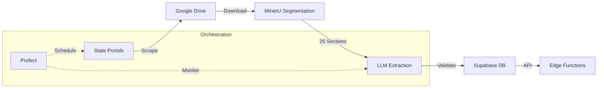

# FDD Pipeline - Franchise Disclosure Document Processing System

## Overview

The FDD Pipeline is an automated system for acquiring, processing, and analyzing Franchise Disclosure Documents (FDDs) from state regulatory portals. It uses advanced document processing techniques including layout analysis, LLM-based extraction, and structured data validation to transform unstructured PDF documents into queryable, normalized data.

## Key Features

- 🌐 **Automated Web Scraping**: Crawls Minnesota and Wisconsin franchise portals weekly
- 📄 **Intelligent Document Processing**: Uses MinerU for layout analysis and segmentation
- 🤖 **LLM-Powered Extraction**: Leverages Gemini Pro, Ollama, and OpenAI for structured data extraction
- ✅ **Multi-Tier Validation**: Schema validation, business rules, and quality checks
- 📊 **Normalized Data Storage**: Structured tables for high-value items (5, 6, 7, 19, 20, 21)
- ☁️ **Cloud-Native Storage**: Google Drive for documents, Supabase for data
- 🔄 **Workflow Orchestration**: Prefect manages pipeline execution and monitoring
- 🔍 **Intelligent Deduplication**: Fuzzy matching and embeddings prevent duplicate processing

## Architecture



## Quick Start

### Prerequisites
- Python 3.11+
- UV package manager
- Supabase account
- Google Cloud service account
- MinerU API access

### Installation

```bash
# Clone the repository
git clone https://github.com/yourorg/fdd-pipeline.git
cd fdd-pipeline

# Install UV if not already installed
pip install uv

# Create virtual environment and install dependencies
uv venv
uv pip sync requirements.txt

# Copy environment template and configure
cp .env.template .env
# Edit .env with your credentials
```

### Configuration

1. **Supabase Setup**:
   ```bash
   # Run migrations
   supabase db push
   ```

2. **Google Drive Setup**:
   - Create a service account in Google Cloud Console
   - Share your Drive folder with the service account email
   - Save credentials JSON to path specified in GDRIVE_CREDS_JSON

3. **Configure Environment**:
   ```bash
   # Key environment variables in .env:
   SUPABASE_URL=https://your-project.supabase.co
   SUPABASE_ANON_KEY=your-anon-key
   SUPABASE_SERVICE_KEY=your-service-key
   GDRIVE_FOLDER_ID=your-drive-folder-id
   GEMINI_API_KEY=your-gemini-key
   MINERU_API_KEY=your-mineru-key
   ```

### Running the Pipeline

```bash
# Start Prefect server
prefect server start

# Deploy flows
prefect deployment build flows/scrape_mn.py:scrape_minnesota -n mn-weekly
prefect deployment build flows/scrape_wi.py:scrape_wisconsin -n wi-weekly
prefect deployment apply

# Start agent
prefect agent start -q default

# Trigger manual run
prefect deployment run scrape-minnesota/mn-weekly
```

## Project Structure

```
fdd-pipeline/
├── flows/              # Prefect workflow definitions
├── models/             # Pydantic models for each FDD section
├── prompts/            # YAML prompt templates for LLM extraction
├── tasks/              # Reusable Prefect tasks
├── utils/              # Helper functions
├── migrations/         # Supabase schema migrations
├── tests/              # Test suite
├── docs/               # Detailed documentation
└── config.py           # Centralized configuration
```

## Documentation

- [Architecture Guide](ARCHITECTURE.md) - System design and data flow
- [Tech Stack](TECH_STACK.md) - Complete dependency list
- [Setup Guide](docs/03_implementation/setup_guide.md) - Detailed setup instructions
- [Data Model](docs/02_data_model/database_schema.md) - Database schema reference
- [API Reference](docs/05_api_reference/) - Internal and edge function APIs

## Key Workflows

### 1. Document Acquisition
- Weekly scheduled scrapes of state portals
- Metadata extraction and deduplication
- Cloud storage in organized folder structure

### 2. Document Processing
- Layout analysis to identify 25 FDD sections (Intro + Items 1-23 + Appendix)
- Segmentation into individual PDFs
- Section-specific LLM extraction

### 3. Data Validation
- Schema validation with Pydantic
- Business rule enforcement
- Quality scoring and human review flags

## Monitoring & Operations

- **Prefect Dashboard**: http://localhost:4200 (when server running)
- **Email Alerts**: Configured for pipeline failures
- **Logs**: Stored in `pipeline_logs` table
- **Metrics**: Section extraction success rates, processing times

## Development

```bash
# Install dev dependencies
uv pip install -e ".[dev]"

# Run pre-commit hooks
pre-commit install

# Run tests
pytest

# Format code
black .

# Type checking
mypy .
```

## Contributing

1. Fork the repository
2. Create a feature branch (`git checkout -b feature/amazing-feature`)
3. Commit your changes (`git commit -m 'Add amazing feature'`)
4. Push to the branch (`git push origin feature/amazing-feature`)
5. Open a Pull Request

## License

This project is proprietary software. All rights reserved.

## Support

For questions or issues:
- Check [Troubleshooting Guide](docs/04_operations/troubleshooting.md)
- Email: support@yourcompany.com
- Create an issue in the repository