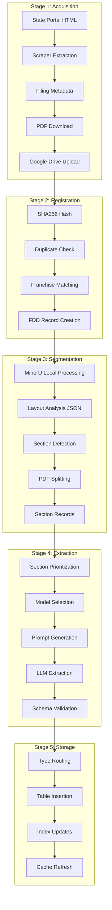
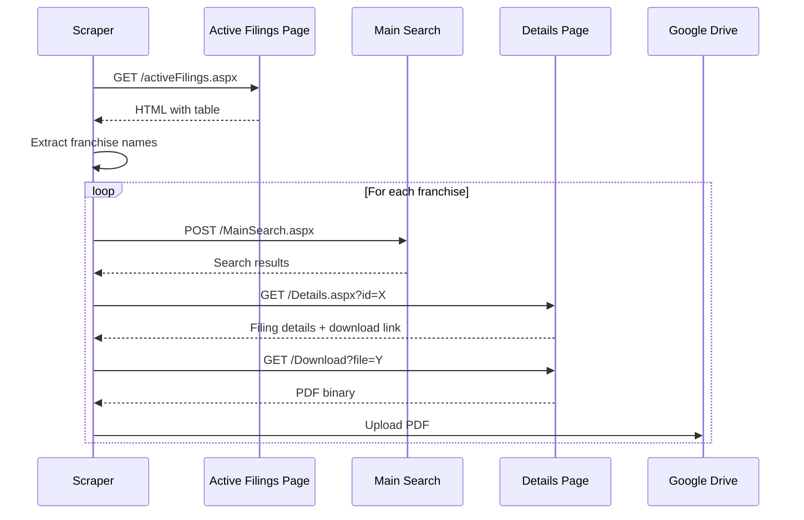
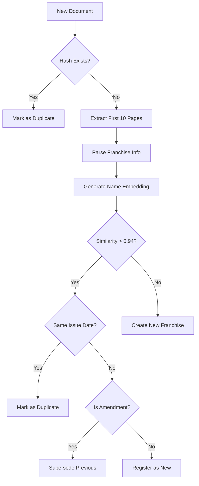
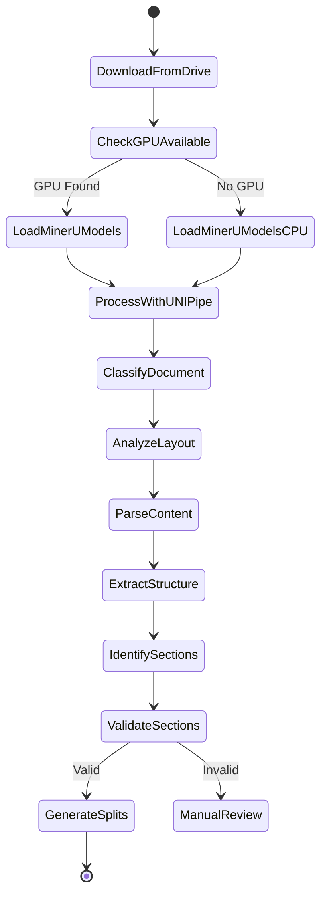
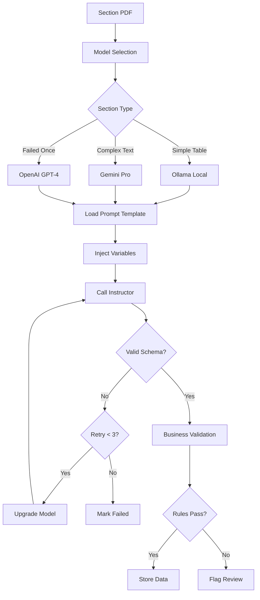
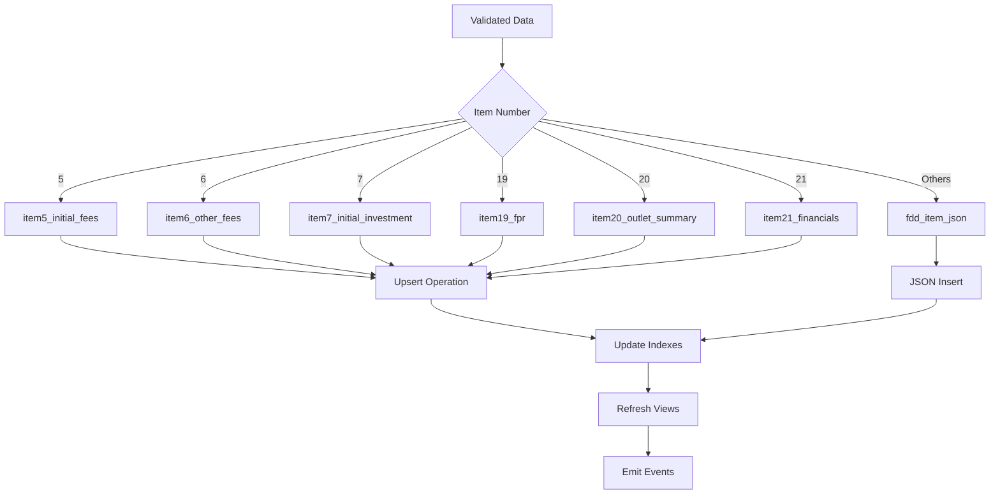
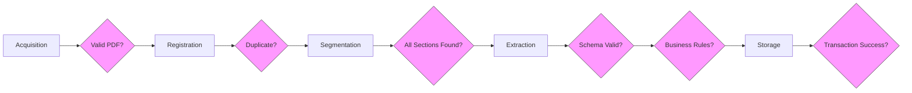

# Data Flow Documentation

## Overview

This document details how data flows through the FDD Pipeline from initial acquisition to final storage. Each stage includes data transformations, validation points, and error handling mechanisms.

## End-to-End Data Flow



## Stage 1: Document Acquisition

### 1.1 Web Scraping Flow

**Minnesota Portal Flow**:
```python
# Simplified flow representation
async def scrape_minnesota():
    # 1. Fetch search page
    response = await fetch("https://mn.gov/commerce/fdd/search")
    
    # 2. Extract document links
    documents = parse_search_results(response.html)
    
    # 3. For each document
    for doc in documents:
        metadata = {
            "source": "MN",
            "filing_number": doc.filing_id,
            "filing_date": doc.date,
            "franchise_name": doc.name,
            "document_url": doc.pdf_url
        }
        
        # 4. Download PDF
        pdf_content = await download_pdf(doc.pdf_url)
        
        # 5. Upload to Drive
        file_id = await upload_to_drive(pdf_content, metadata)
        
        yield DocumentRecord(metadata, file_id)
```

**Wisconsin Portal Flow**:


### 1.2 Data Captured at Acquisition

| Field | Type | Source | Example |
|-------|------|--------|---------|
| source_name | string | Hardcoded | "MN", "WI" |
| filing_number | string | Portal HTML | "FDD-2024-001" |
| filing_date | date | Portal HTML | "2024-01-15" |
| franchise_name | string | Portal HTML | "Subway Restaurants" |
| document_url | string | Portal HTML | "https://..." |
| download_timestamp | timestamp | System | "2024-01-20T10:30:00Z" |
| file_size_bytes | integer | HTTP headers | 2456789 |
| sha256_hash | string | Computed | "a1b2c3..." |

## Stage 2: Document Registration

### 2.1 Deduplication Flow



### 2.2 Franchise Matching Algorithm

```python
def match_franchise(extracted_info: dict) -> Optional[UUID]:
    # 1. Exact name match
    exact_match = db.query(
        "SELECT id FROM franchisors WHERE canonical_name = ?",
        extracted_info["franchise_name"]
    )
    if exact_match:
        return exact_match.id
    
    # 2. Embedding similarity
    embedding = generate_embedding(extracted_info["franchise_name"])
    similar = db.query("""
        SELECT id, canonical_name, 
               1 - (name_embedding <=> ?) as similarity
        FROM franchisors
        WHERE 1 - (name_embedding <=> ?) > 0.85
        ORDER BY similarity DESC
        LIMIT 5
    """, embedding, embedding)
    
    # 3. Apply business rules
    for candidate in similar:
        if similarity > 0.94:
            return candidate.id
        elif similarity > 0.85:
            # Flag for human review
            mark_for_review(extracted_info, candidate)
    
    # 4. Create new franchise
    return create_franchise(extracted_info)
```

## Stage 3: Document Segmentation

### 3.1 MinerU Processing Pipeline (Local)



### 3.2 Section Detection Logic

```python
def detect_sections(mineru_output: dict) -> List[Section]:
    """Process MinerU local output to identify FDD sections"""
    sections = []
    
    # Pass 1: High confidence - Title blocks from MinerU layout analysis
    for block in mineru_output["blocks"]:
        if block["type"] == "title":
            match = re.search(r"ITEM\s+(\d+)", block["text"], re.I)
            if match:
                item_no = int(match.group(1))
                sections.append(Section(
                    item_no=item_no,
                    start_page=block["page_no"],
                    confidence=0.95
                ))
    
    # Pass 2: Medium confidence - Text search in MinerU extracted content
    if len(sections) < 20:  # Missing sections
        for block in mineru_output["blocks"]:
            if block["type"] == "text":
                # Complex regex patterns for each item
                patterns = get_item_patterns()
                for item_no, pattern in patterns.items():
                    if pattern.search(block["text"]):
                        sections.append(Section(
                            item_no=item_no,
                            start_page=block["page_no"],
                            confidence=0.75
                        ))
    
    # Pass 3: Validation and interpolation
    sections = validate_section_order(sections)
    sections = interpolate_missing(sections)
    
    return sections
```

### 3.3 MinerU Local Integration

```python
async def process_with_mineru_local(fdd_id: UUID, pdf_path: str):
    """Process PDF using local MinerU installation"""
    import os
    from magic_pdf.pipe.UNIPipe import UNIPipe
    from magic_pdf.rw.DiskReaderWriter import DiskReaderWriter
    
    # Configure based on available hardware
    device = os.getenv('MINERU_DEVICE', 'cuda')
    batch_size = int(os.getenv('MINERU_BATCH_SIZE', '2'))
    
    # Setup output directory
    output_dir = f"processed/{fdd_id}"
    os.makedirs(output_dir, exist_ok=True)
    image_writer = DiskReaderWriter(f"{output_dir}/images")
    
    # Read PDF
    with open(pdf_path, "rb") as f:
        pdf_bytes = f.read()
    
    # Process with MinerU
    pipe = UNIPipe(
        pdf_bytes,
        {"_pdf_type": "", "model_list": []},
        image_writer
    )
    
    # Three-stage processing pipeline
    pipe.pipe_classify()  # Classify document type
    pipe.pipe_analyze()   # Analyze layout structure
    pipe.pipe_parse()     # Extract content
    
    # Get structured output
    layout_data = pipe.get_layout_data()
    markdown = pipe.pipe_mk_markdown("images", drop_mode="none")
    
    # Extract sections from layout data
    sections = detect_sections(layout_data)
    
    return {
        "sections": sections,
        "markdown": markdown,
        "layout_data": layout_data,
        "processing_device": device
    }
```

### 3.4 PDF Splitting Process

```python
async def split_pdf(fdd_id: UUID, sections: List[Section]):
    # Download original PDF
    original_pdf = await download_from_drive(fdd.drive_file_id)
    
    # Create section PDFs
    for i, section in enumerate(sections):
        # Determine page range
        start = section.start_page
        end = sections[i+1].start_page - 1 if i+1 < len(sections) else total_pages
        
        # Extract pages
        section_pdf = extract_pages(original_pdf, start, end)
        
        # Upload to Drive
        section_path = f"/processed/{fdd.franchise_id}/{fdd.year}/section_{section.item_no:02d}.pdf"
        file_id = await upload_to_drive(section_pdf, section_path)
        
        # Create database record
        await db.insert("fdd_sections", {
            "fdd_id": fdd_id,
            "item_no": section.item_no,
            "start_page": start,
            "end_page": end,
            "drive_file_id": file_id,
            "extraction_status": "pending"
        })
```

## Stage 4: Data Extraction

### 4.1 LLM Extraction Flow



### 4.2 Model Selection Matrix

| Section | Primary Model | Fallback | Criteria |
|---------|--------------|----------|----------|
| Item 5 (Fees) | Ollama phi3 | Gemini Pro | Simple table, low variance |
| Item 6 (Other Fees) | Ollama llama3:8b | Gemini Pro | Semi-structured list |
| Item 7 (Investment) | Ollama llama3:8b | Gemini Pro | Standard table format |
| Item 19 (FPR) | Gemini Pro 2.5 | GPT-4 | High variance, complex |
| Item 20 (Outlets) | Ollama llama3:8b | Gemini Pro | Structured tables |
| Item 21 (Financials) | Gemini Pro 2.5 | GPT-4 | Financial statements |
| Others | Gemini Pro 2.5 | GPT-4 | Unstructured text |

### 4.3 Prompt Engineering

```yaml
# Example: prompts/item20.yaml
system: |
  You are an expert at extracting franchise outlet data from FDD Item 20.
  Extract ALL tables showing outlet counts by year and state.
  Follow the schema exactly.

user: |
  Extract outlet information from this FDD Item 20 section:
  
  Document: {{ franchise_name }} - {{ issue_year }}
  
  Content:
  {{ section_text }}

few_shot_examples:
  - input: |
      Table No. 1
      Systemwide Outlet Summary
      For Years 2021 to 2023
      
      Outlet Type | Year | Start | Opened | Closed | End
      Franchised | 2021 | 100 | 25 | 10 | 115
      Company | 2021 | 20 | 5 | 2 | 23
    
    output:
      outlet_summary:
        - fiscal_year: 2021
          outlet_type: "Franchised"
          count_start: 100
          opened: 25
          closed: 10
          count_end: 115
```

### 4.4 Structured Output Enforcement

```python
from instructor import patch
from pydantic import BaseModel, validator

class Item20Summary(BaseModel):
    fiscal_year: int
    outlet_type: Literal["Franchised", "Company-Owned"]
    count_start: int
    opened: int
    closed: int
    transferred_in: int = 0
    transferred_out: int = 0
    count_end: int
    
    @validator('count_end')
    def validate_math(cls, v, values):
        expected = (values['count_start'] + values['opened'] 
                   - values['closed'] + values.get('transferred_in', 0)
                   - values.get('transferred_out', 0))
        if v != expected:
            raise ValueError(f"Math doesn't add up: {expected} != {v}")
        return v

# Use with Instructor
client = patch(OpenAI())
response = client.chat.completions.create(
    model="gpt-4",
    messages=[...],
    response_model=List[Item20Summary]
)
```

## Stage 5: Data Storage

### 5.1 Storage Routing Logic



### 5.2 Database Transaction Flow

```python
async def store_extraction_result(section_id: UUID, item_no: int, data: dict):
    async with db.transaction() as tx:
        try:
            # 1. Route to appropriate table
            if item_no == 20:
                # Insert outlet summaries
                for record in data["outlet_summary"]:
                    await tx.execute("""
                        INSERT INTO item20_outlet_summary 
                        (section_id, fiscal_year, outlet_type, ...)
                        VALUES ($1, $2, $3, ...)
                        ON CONFLICT (section_id, fiscal_year, outlet_type)
                        DO UPDATE SET ...
                    """, section_id, record["fiscal_year"], ...)
                
                # Insert state counts
                for state in data.get("state_counts", []):
                    await tx.execute(...)
            
            elif item_no in [5, 6, 7, 19, 21]:
                # Handle other structured tables
                ...
            
            else:
                # Generic JSON storage
                await tx.execute("""
                    INSERT INTO fdd_item_json (section_id, item_no, data)
                    VALUES ($1, $2, $3)
                """, section_id, item_no, json.dumps(data))
            
            # 2. Update section status
            await tx.execute("""
                UPDATE fdd_sections 
                SET extraction_status = 'success',
                    extracted_at = NOW(),
                    extraction_model = $2
                WHERE id = $1
            """, section_id, model_used)
            
            # 3. Check if all sections complete
            await check_fdd_completion(tx, section.fdd_id)
            
            await tx.commit()
            
        except Exception as e:
            await tx.rollback()
            await log_extraction_error(section_id, str(e))
            raise
```

## Data Quality Checkpoints

### Quality Gates Throughout Pipeline



### Error Handling Strategy

| Stage | Error Type | Handling | Recovery |
|-------|------------|----------|----------|
| Acquisition | Network timeout | Retry 3x with backoff | Re-run scraper |
| Registration | Duplicate found | Skip processing | Manual review |
| Segmentation | Missing sections | Flag for review | Manual split |
| Extraction | Schema invalid | Retry with better model | Human correction |
| Storage | Transaction fail | Rollback + retry | Investigate logs |

## Performance Characteristics

### Data Volume Metrics

| Metric | Value | Notes |
|--------|-------|-------|
| Avg PDF size | 2.5 MB | Range: 500KB - 10MB |
| Sections per FDD | 25 | Intro (0) + Items 1-23 + Appendix (24) |
| Extraction time/section | 15-30s | Depends on model |
| Total processing time | 5-10 min | Full pipeline |
| Daily throughput | 100+ FDDs | With current resources |

### Bottleneck Analysis

1. **MinerU API**: Rate limited to 10 concurrent
   - Solution: Queue management
   
2. **LLM API Calls**: Cost and rate limits
   - Solution: Local models for simple tasks
   
3. **Database Writes**: Connection pooling
   - Solution: Batch inserts where possible

## Data Lineage

Every piece of data can be traced back through:

```
Final Data → fdd_sections → fdds → scrape_metadata → Source Portal
           ↘ extraction_logs ↗
```

This enables:
- Debugging extraction issues
- Re-processing from any stage
- Audit trail for compliance
- Quality improvement analysis

---

For implementation details, see:
- [Technology Decisions](technology_decisions.md)
- [Validation Rules](../02_data_model/validation_rules.md)