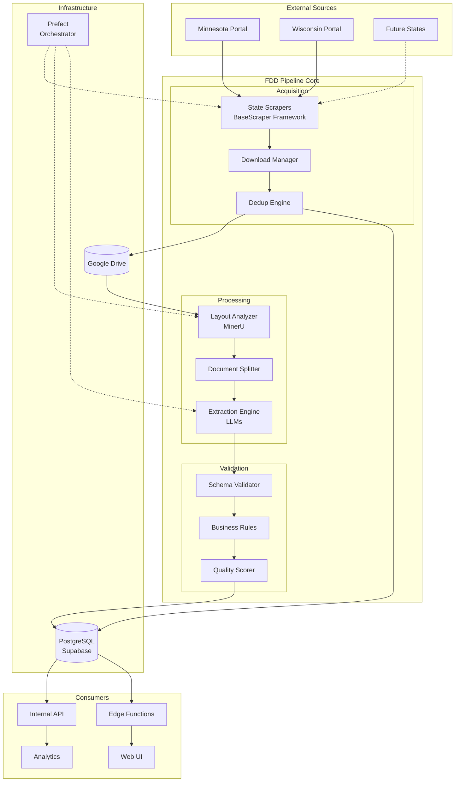
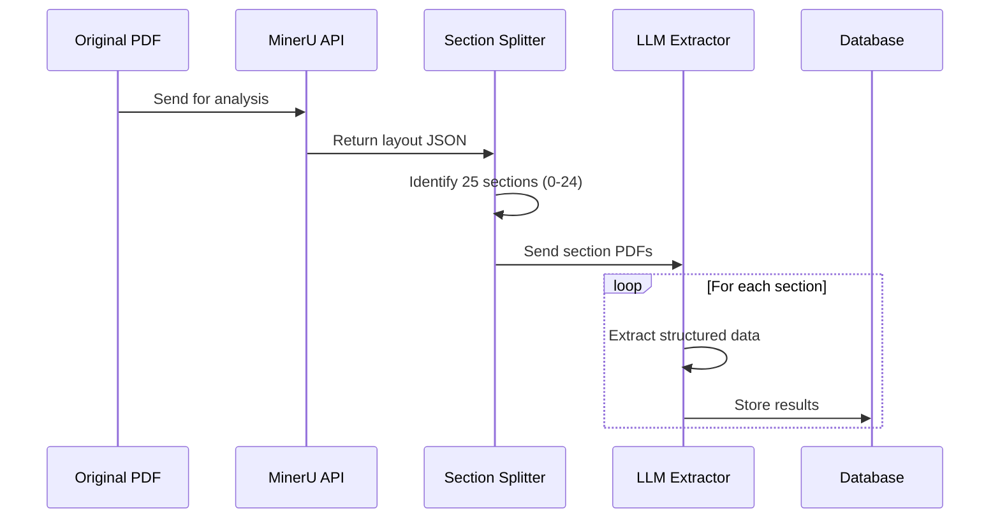
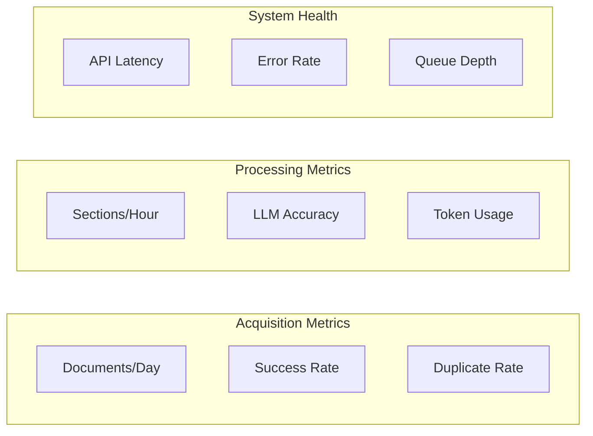

# System Overview

## Executive Summary

The FDD Pipeline is an automated document intelligence system that transforms unstructured Franchise Disclosure Documents (FDDs) into structured, queryable data. It combines web scraping, document analysis, AI-powered extraction, and cloud storage to create a comprehensive franchise intelligence platform.

## System Goals

### Primary Objectives
1. **Automated Acquisition**: Continuously monitor and download FDDs from state regulatory portals
2. **Intelligent Processing**: Extract structured data from 25 FDD sections (Intro + Items 1-23 + Appendix)
3. **Data Quality**: Ensure high accuracy through multi-tier validation
4. **Scalability**: Handle thousands of documents efficiently
5. **Accessibility**: Provide clean APIs for downstream applications

### Key Metrics
- **Processing Throughput**: 100+ FDDs per day
- **Extraction Accuracy**: >95% for structured sections
- **System Uptime**: 99.5% availability
- **End-to-End Latency**: <10 minutes per document

## High-Level Architecture



## Core Components

### 1. Acquisition Subsystem

**Purpose**: Automated collection of FDD documents from various sources.

**Key Components**:
- **Unified Scraper Framework**: BaseScraper class with inheritance-based state implementations
- **Common Utilities**: Shared functions for filename sanitization, date parsing, URL normalization
- **Download Manager**: Streaming downloads with progress tracking and retry logic
- **Deduplication Engine**: Prevents duplicate processing using fuzzy matching

**Data Flow**:
1. Scrapers poll state portals on schedule
2. Extract metadata and download URLs
3. Download PDFs directly to Google Drive
4. Check for duplicates using embeddings
5. Register new documents in database

### 2. Document Processing Subsystem

**Purpose**: Transform PDFs into structured, section-based data.

**Processing Pipeline**:



**Key Technologies**:
- **MinerU**: AI-powered layout analysis
- **Section Detection**: Rule-based + ML hybrid approach
- **LLM Routing**: Model selection based on complexity

### 3. Validation Subsystem

**Purpose**: Ensure data quality and consistency.

**Validation Layers**:

| Layer | Purpose | Examples | Action |
|-------|---------|----------|--------|
| Schema | Structure validation | Required fields, types | Retry/Fail |
| Business | Domain rules | Sum validations, date logic | Flag/Review |
| Quality | Completeness | Missing data, OCR quality | Score/Alert |

### 4. Storage Architecture

**Document Storage (Google Drive)**:
```
/fdds/
├── /raw/                  # Original PDFs
│   ├── /mn/
│   └── /wi/
├── /processed/            # Segmented PDFs
│   └── /{franchise_id}/
│       └── /{year}/
│           ├── section_01.pdf
│           └── ...
└── /archive/              # Old/superseded
```

**Data Storage (PostgreSQL/Supabase)**:
- Normalized tables for Items 5, 6, 7, 19, 20, 21
- JSON storage for other sections
- Full audit trail and versioning

## System Interactions

### Synchronous Operations
1. **API Queries**: Real-time data access
2. **Status Checks**: Pipeline monitoring
3. **Manual Uploads**: Direct document submission

### Asynchronous Operations
1. **Scheduled Scraping**: Weekly portal checks
2. **Document Processing**: Queue-based extraction
3. **Batch Validation**: Nightly quality checks

## Security & Compliance

### Data Security
- **Encryption**: TLS for all external communications
- **Authentication**: Service accounts with minimal permissions
- **Access Control**: Row-level security in database
- **Audit Trail**: Complete operation logging

### Compliance Considerations
- **Data Retention**: 7-year archive policy
- **Privacy**: No PII extraction or storage
- **Licensing**: Respect portal terms of service
- **Right to Deletion**: Support for data removal requests

## Scalability Design

### Horizontal Scaling Points
- **Scrapers**: Multiple agents per state
- **Processing**: Parallel section extraction
- **API**: Load-balanced endpoints

### Vertical Scaling Options
- **Database**: Auto-scaling with Supabase
- **LLM Calls**: Rate limiting and queuing
- **Storage**: Unlimited Google Drive capacity

### Performance Optimizations
1. **Caching**: Embedding vectors for deduplication
2. **Batching**: Group similar extraction tasks
3. **Compression**: Archive old documents
4. **Indexing**: Optimized database queries

## Monitoring & Observability

### Key Metrics Dashboard



### Alerting Triggers
- Pipeline failures
- Extraction accuracy < 95%
- API response time > 2s
- Storage usage > 80%

## Disaster Recovery

### Backup Strategy
- **Database**: Daily automated backups
- **Documents**: Google Drive versioning
- **Code**: Git repository mirrors
- **Secrets**: Encrypted vault backup

### Recovery Procedures
1. **Data Loss**: Restore from latest backup
2. **Service Outage**: Failover to backup services
3. **Corruption**: Reprocess from raw documents
4. **Security Breach**: Rotate all credentials

## Future Architecture Evolution

### Phase 2 (6 months)
- Additional state portals
- Real-time processing pipeline
- Advanced deduplication ML
- Public API gateway

### Phase 3 (12 months)
- Multi-region deployment
- Custom extraction models
- Streaming data platform
- Enterprise integrations

## System Boundaries

### In Scope
- FDD document processing
- State portal scraping
- Structured data extraction
- API access layer

### Out of Scope
- Document generation
- Legal analysis
- Franchise recommendations
- Payment processing

## Technology Stack Summary

| Layer | Technology | Purpose |
|-------|------------|---------|
| Orchestration | Prefect | Workflow management |
| Web Scraping | Playwright | Browser automation |
| Storage | Google Drive | Document storage |
| Database | Supabase/PostgreSQL | Structured data |
| AI/ML | Gemini/Ollama | Text extraction |
| API | FastAPI | Internal services |
| Monitoring | Prefect + Custom | System observability |

---

For detailed component documentation, see:
- [Data Flow](data_flow.md) - Detailed pipeline stages
- [Technology Decisions](technology_decisions.md) - Architecture choices explained