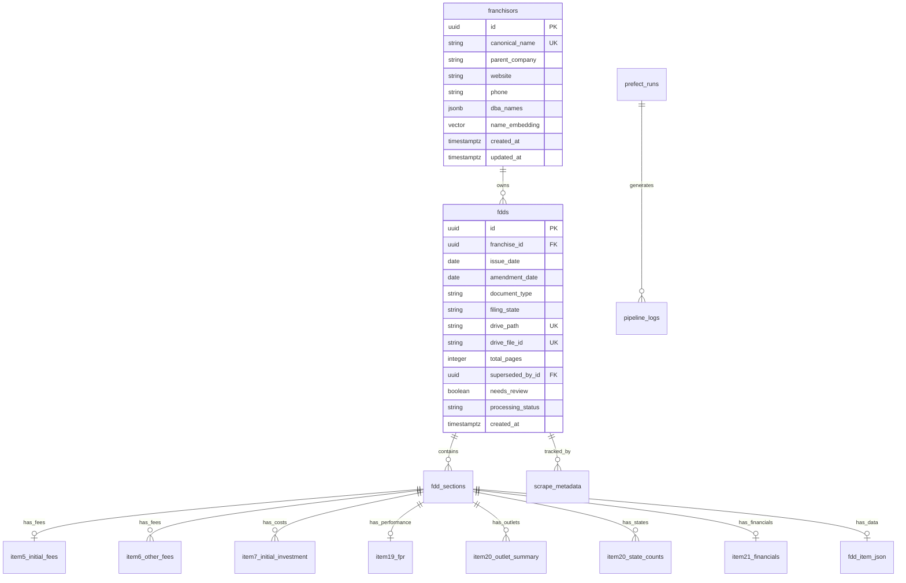

# Database Schema Documentation

## Overview

The FDD Pipeline uses PostgreSQL (via Supabase) as its primary database. The schema is designed to support efficient document tracking, structured data extraction, and analytics while maintaining referential integrity and audit trails.

## Entity Relationship Diagram



## Core Tables

### franchisors
Stores canonical franchise information with deduplication support.

```sql
CREATE TABLE franchisors (
    id UUID PRIMARY KEY DEFAULT gen_random_uuid(),
    canonical_name TEXT NOT NULL UNIQUE,
    parent_company TEXT,
    website TEXT,
    phone TEXT,
    email TEXT,
    address JSONB, -- {street, city, state, zip}
    dba_names JSONB DEFAULT '[]'::jsonb, -- array of alternate names
    name_embedding vector(384), -- for similarity search
    created_at TIMESTAMPTZ DEFAULT now(),
    updated_at TIMESTAMPTZ DEFAULT now()
);

-- Indexes
CREATE INDEX idx_franchisors_canonical_name ON franchisors(canonical_name);
CREATE INDEX idx_franchisors_parent_company ON franchisors(parent_company);
CREATE INDEX idx_franchisors_embedding ON franchisors USING ivfflat (name_embedding vector_cosine_ops);
```

### fdds
Tracks individual FDD documents with versioning and supersession.

```sql
CREATE TABLE fdds (
    id UUID PRIMARY KEY DEFAULT gen_random_uuid(),
    franchise_id UUID REFERENCES franchisors(id) ON DELETE CASCADE,
    issue_date DATE NOT NULL,
    amendment_date DATE,
    is_amendment BOOLEAN GENERATED ALWAYS AS (amendment_date IS NOT NULL) STORED,
    document_type TEXT NOT NULL CHECK (document_type IN ('Initial', 'Amendment', 'Renewal')),
    filing_state TEXT NOT NULL,
    filing_number TEXT,
    drive_path TEXT NOT NULL UNIQUE,
    drive_file_id TEXT NOT NULL UNIQUE,
    sha256_hash CHAR(64),
    total_pages INTEGER,
    language_code TEXT DEFAULT 'en',
    superseded_by_id UUID REFERENCES fdds(id),
    duplicate_of_id UUID REFERENCES fdds(id),
    needs_review BOOLEAN DEFAULT false,
    processing_status TEXT DEFAULT 'pending' CHECK (processing_status IN ('pending', 'processing', 'completed', 'failed')),
    created_at TIMESTAMPTZ DEFAULT now(),
    processed_at TIMESTAMPTZ
);

-- Indexes
CREATE INDEX idx_fdds_franchise_id ON fdds(franchise_id);
CREATE INDEX idx_fdds_issue_date ON fdds(issue_date);
CREATE INDEX idx_fdds_filing_state ON fdds(filing_state);
CREATE INDEX idx_fdds_processing_status ON fdds(processing_status);
CREATE INDEX idx_fdds_needs_review ON fdds(needs_review) WHERE needs_review = true;
```

### scrape_metadata
Captures web scraping provenance and metadata.

```sql
CREATE TABLE scrape_metadata (
    id UUID PRIMARY KEY DEFAULT gen_random_uuid(),
    fdd_id UUID REFERENCES fdds(id) ON DELETE CASCADE,
    source_name TEXT NOT NULL, -- 'MN', 'WI'
    source_url TEXT NOT NULL,
    filing_metadata JSONB, -- portal-specific fields
    prefect_run_id UUID,
    scraped_at TIMESTAMPTZ DEFAULT now()
);

-- Indexes
CREATE INDEX idx_scrape_metadata_fdd_id ON scrape_metadata(fdd_id);
CREATE INDEX idx_scrape_metadata_source ON scrape_metadata(source_name, scraped_at);
```

### fdd_sections
Maps document sections after MinerU segmentation.

```sql
CREATE TABLE fdd_sections (
    id UUID PRIMARY KEY DEFAULT gen_random_uuid(),
    fdd_id UUID REFERENCES fdds(id) ON DELETE CASCADE,
    item_no INTEGER NOT NULL CHECK (item_no >= 0 AND item_no <= 24), -- 0=intro, 24=appendix
    item_name TEXT,
    start_page INTEGER NOT NULL,
    end_page INTEGER NOT NULL CHECK (end_page >= start_page),
    drive_path TEXT,
    drive_file_id TEXT,
    extraction_status TEXT DEFAULT 'pending' CHECK (extraction_status IN ('pending', 'processing', 'success', 'failed', 'skipped')),
    extraction_model TEXT, -- which LLM was used
    extraction_attempts INTEGER DEFAULT 0,
    needs_review BOOLEAN DEFAULT false,
    created_at TIMESTAMPTZ DEFAULT now(),
    extracted_at TIMESTAMPTZ,
    
    CONSTRAINT unique_fdd_section UNIQUE (fdd_id, item_no)
);

-- Indexes
CREATE INDEX idx_fdd_sections_fdd_id ON fdd_sections(fdd_id);
CREATE INDEX idx_fdd_sections_status ON fdd_sections(extraction_status);
CREATE INDEX idx_fdd_sections_needs_review ON fdd_sections(needs_review) WHERE needs_review = true;
```

## Structured Data Tables

### item5_initial_fees
Initial franchise fees and conditions.

```sql
CREATE TABLE item5_initial_fees (
    section_id UUID REFERENCES fdd_sections(id) ON DELETE CASCADE,
    fee_name TEXT NOT NULL,
    amount_cents BIGINT NOT NULL CHECK (amount_cents >= 0),
    refundable BOOLEAN DEFAULT false,
    refund_conditions TEXT,
    due_at TEXT, -- 'Signing', 'Training', 'Opening'
    notes TEXT,
    
    PRIMARY KEY (section_id, fee_name)
);

-- Common fee_name values:
-- 'Initial Franchise Fee', 'Territory Fee', 'Training Fee'
```

### item6_other_fees
Ongoing and other fees.

```sql
CREATE TABLE item6_other_fees (
    section_id UUID REFERENCES fdd_sections(id) ON DELETE CASCADE,
    fee_name TEXT NOT NULL,
    amount_cents BIGINT CHECK (amount_cents >= 0),
    amount_percentage NUMERIC(5,2) CHECK (amount_percentage >= 0 AND amount_percentage <= 100),
    frequency TEXT NOT NULL, -- 'Weekly', 'Monthly', 'Annual', 'One-time'
    calculation_basis TEXT, -- 'Gross Sales', 'Net Sales', 'Fixed'
    minimum_cents BIGINT CHECK (minimum_cents >= 0),
    maximum_cents BIGINT CHECK (maximum_cents >= minimum_cents),
    remarks TEXT,
    
    PRIMARY KEY (section_id, fee_name),
    CONSTRAINT check_amount_or_percentage CHECK (
        (amount_cents IS NOT NULL AND amount_percentage IS NULL) OR
        (amount_cents IS NULL AND amount_percentage IS NOT NULL)
    )
);

-- Common fee_name values:
-- 'Royalty Fee', 'Marketing Fee', 'Technology Fee', 'Supply Chain Fee'
```

### item7_initial_investment
Estimated initial investment breakdown.

```sql
CREATE TABLE item7_initial_investment (
    section_id UUID REFERENCES fdd_sections(id) ON DELETE CASCADE,
    category TEXT NOT NULL,
    low_cents BIGINT CHECK (low_cents >= 0),
    high_cents BIGINT CHECK (high_cents >= low_cents),
    when_due TEXT,
    to_whom TEXT,
    remarks TEXT,
    
    PRIMARY KEY (section_id, category)
);

-- Common categories:
-- 'Real Estate', 'Equipment', 'Inventory', 'Working Capital'
```

### item19_fpr
Financial Performance Representations.

```sql
CREATE TABLE item19_fpr (
    section_id UUID PRIMARY KEY REFERENCES fdd_sections(id) ON DELETE CASCADE,
    disclosure_type TEXT, -- 'Historical', 'Projected', 'None'
    methodology TEXT, -- narrative description
    sample_size INTEGER CHECK (sample_size > 0),
    sample_description TEXT,
    time_period TEXT,
    
    -- Common financial metrics (all nullable)
    average_revenue_cents BIGINT CHECK (average_revenue_cents >= 0),
    median_revenue_cents BIGINT CHECK (median_revenue_cents >= 0),
    low_revenue_cents BIGINT CHECK (low_revenue_cents >= 0),
    high_revenue_cents BIGINT CHECK (high_revenue_cents >= 0),
    
    average_profit_cents BIGINT,
    median_profit_cents BIGINT,
    profit_margin_percentage NUMERIC(5,2),
    
    -- For complex/varied data
    additional_metrics JSONB DEFAULT '{}'::jsonb,
    tables_data JSONB DEFAULT '[]'::jsonb, -- array of table representations
    
    disclaimers TEXT,
    created_at TIMESTAMPTZ DEFAULT now()
);
```

### item20_outlet_summary
System-wide outlet information by year.

```sql
CREATE TABLE item20_outlet_summary (
    section_id UUID REFERENCES fdd_sections(id) ON DELETE CASCADE,
    fiscal_year SMALLINT NOT NULL CHECK (fiscal_year >= 1900 AND fiscal_year <= 2100),
    outlet_type TEXT NOT NULL CHECK (outlet_type IN ('Franchised', 'Company-Owned')),
    
    -- Annual movements
    count_start INTEGER NOT NULL CHECK (count_start >= 0),
    opened INTEGER NOT NULL DEFAULT 0 CHECK (opened >= 0),
    closed INTEGER NOT NULL DEFAULT 0 CHECK (closed >= 0),
    transferred_in INTEGER NOT NULL DEFAULT 0 CHECK (transferred_in >= 0),
    transferred_out INTEGER NOT NULL DEFAULT 0 CHECK (transferred_out >= 0),
    count_end INTEGER NOT NULL CHECK (count_end >= 0),
    
    -- Calculated check
    CONSTRAINT outlet_math_check CHECK (
        count_end = count_start + opened - closed + transferred_in - transferred_out
    ),
    
    PRIMARY KEY (section_id, fiscal_year, outlet_type)
);

-- State-by-state breakdown
CREATE TABLE item20_state_counts (
    section_id UUID REFERENCES fdd_sections(id) ON DELETE CASCADE,
    state_code CHAR(2) NOT NULL,
    franchised_count INTEGER DEFAULT 0 CHECK (franchised_count >= 0),
    company_owned_count INTEGER DEFAULT 0 CHECK (company_owned_count >= 0),
    
    PRIMARY KEY (section_id, state_code)
);
```

### item21_financials
Summarized financial statements.

```sql
CREATE TABLE item21_financials (
    section_id UUID PRIMARY KEY REFERENCES fdd_sections(id) ON DELETE CASCADE,
    fiscal_year SMALLINT CHECK (fiscal_year >= 1900 AND fiscal_year <= 2100),
    fiscal_year_end DATE,
    
    -- Income Statement
    total_revenue_cents BIGINT CHECK (total_revenue_cents >= 0),
    franchise_revenue_cents BIGINT CHECK (franchise_revenue_cents >= 0),
    cost_of_goods_cents BIGINT CHECK (cost_of_goods_cents >= 0),
    gross_profit_cents BIGINT,
    operating_expenses_cents BIGINT CHECK (operating_expenses_cents >= 0),
    operating_income_cents BIGINT,
    net_income_cents BIGINT,
    
    -- Balance Sheet
    total_assets_cents BIGINT CHECK (total_assets_cents >= 0),
    current_assets_cents BIGINT CHECK (current_assets_cents >= 0),
    total_liabilities_cents BIGINT CHECK (total_liabilities_cents >= 0),
    current_liabilities_cents BIGINT CHECK (current_liabilities_cents >= 0),
    total_equity_cents BIGINT,
    
    -- Audit info
    auditor_name TEXT,
    audit_opinion TEXT,
    
    created_at TIMESTAMPTZ DEFAULT now()
);
```

### fdd_item_json
Generic storage for all other items.

```sql
CREATE TABLE fdd_item_json (
    section_id UUID PRIMARY KEY REFERENCES fdd_sections(id) ON DELETE CASCADE,
    item_no INTEGER NOT NULL,
    data JSONB NOT NULL DEFAULT '{}'::jsonb,
    schema_version TEXT DEFAULT '1.0',
    validated BOOLEAN DEFAULT false,
    validation_errors JSONB,
    created_at TIMESTAMPTZ DEFAULT now(),
    updated_at TIMESTAMPTZ DEFAULT now()
);

-- Index for querying specific fields within JSON
CREATE INDEX idx_fdd_item_json_data ON fdd_item_json USING gin(data);
```

## Operational Tables

### pipeline_logs
Structured logging for all pipeline operations.

```sql
CREATE TABLE pipeline_logs (
    id UUID PRIMARY KEY DEFAULT gen_random_uuid(),
    prefect_run_id UUID,
    task_name TEXT,
    level TEXT NOT NULL CHECK (level IN ('DEBUG', 'INFO', 'WARNING', 'ERROR', 'CRITICAL')),
    message TEXT NOT NULL,
    context JSONB DEFAULT '{}'::jsonb,
    created_at TIMESTAMPTZ DEFAULT now()
);

-- Indexes
CREATE INDEX idx_pipeline_logs_run_id ON pipeline_logs(prefect_run_id);
CREATE INDEX idx_pipeline_logs_level ON pipeline_logs(level, created_at DESC);
CREATE INDEX idx_pipeline_logs_created ON pipeline_logs(created_at DESC);

-- Partition by month for performance
CREATE TABLE pipeline_logs_2024_01 PARTITION OF pipeline_logs
    FOR VALUES FROM ('2024-01-01') TO ('2024-02-01');
```

### prefect_runs
Track Prefect flow runs for debugging.

```sql
CREATE TABLE prefect_runs (
    id UUID PRIMARY KEY,
    flow_name TEXT NOT NULL,
    deployment_name TEXT,
    state TEXT NOT NULL,
    started_at TIMESTAMPTZ,
    completed_at TIMESTAMPTZ,
    parameters JSONB,
    context JSONB,
    created_at TIMESTAMPTZ DEFAULT now()
);
```

## Views

### v_latest_fdds
Shows only the most recent FDD per franchise.

```sql
CREATE VIEW v_latest_fdds AS
SELECT DISTINCT ON (f.id) 
    f.id as franchise_id,
    f.canonical_name,
    fdd.*
FROM franchisors f
JOIN fdds fdd ON f.id = fdd.franchise_id
WHERE fdd.superseded_by_id IS NULL
    AND fdd.duplicate_of_id IS NULL
ORDER BY f.id, fdd.issue_date DESC, fdd.amendment_date DESC NULLS LAST;
```

### v_extraction_status
Summary of extraction progress.

```sql
CREATE VIEW v_extraction_status AS
SELECT 
    fdd.id as fdd_id,
    fdd.franchise_id,
    f.canonical_name,
    COUNT(*) as total_sections,
    COUNT(*) FILTER (WHERE fs.extraction_status = 'success') as extracted_sections,
    COUNT(*) FILTER (WHERE fs.extraction_status = 'failed') as failed_sections,
    COUNT(*) FILTER (WHERE fs.needs_review) as needs_review,
    ROUND(100.0 * COUNT(*) FILTER (WHERE fs.extraction_status = 'success') / COUNT(*), 2) as success_rate
FROM fdds fdd
JOIN franchisors f ON fdd.franchise_id = f.id
JOIN fdd_sections fs ON fdd.id = fs.fdd_id
GROUP BY fdd.id, fdd.franchise_id, f.canonical_name;
```

## Row Level Security (RLS)

```sql
-- Enable RLS on all tables
ALTER TABLE franchisors ENABLE ROW LEVEL SECURITY;
ALTER TABLE fdds ENABLE ROW LEVEL SECURITY;
-- ... etc for all tables

-- Public read access
CREATE POLICY "Public read access" ON franchisors
    FOR SELECT USING (true);

-- Service role has full access
CREATE POLICY "Service role full access" ON franchisors
    FOR ALL USING (auth.jwt() ->> 'role' = 'service_role');

-- Anon users can only read completed data
CREATE POLICY "Anon read completed" ON fdds
    FOR SELECT USING (
        processing_status = 'completed' 
        AND auth.jwt() ->> 'role' = 'anon'
    );
```

## Indexes Strategy

### Performance Indexes
- Foreign keys: All FK columns are indexed
- Common queries: Composite indexes for frequent filter combinations
- JSON fields: GIN indexes for JSONB columns
- Text search: GiST indexes for full-text search (future)

### Example Composite Indexes
```sql
-- For finding documents to process
CREATE INDEX idx_fdds_to_process ON fdds(processing_status, created_at) 
    WHERE processing_status = 'pending';

-- For extraction workload
CREATE INDEX idx_sections_to_extract ON fdd_sections(extraction_status, item_no) 
    WHERE extraction_status IN ('pending', 'failed');
```

## Maintenance

### Vacuum Strategy
```sql
-- Aggressive autovacuum for high-write tables
ALTER TABLE pipeline_logs SET (
    autovacuum_vacuum_scale_factor = 0.1,
    autovacuum_analyze_scale_factor = 0.05
);
```

### Archival Strategy
- `pipeline_logs` older than 90 days → compressed archive
- `scrape_metadata` older than 1 year → cold storage
- Failed extraction attempts → retain for analysis

## Migration Management

All schema changes are managed through numbered migration files:

```
migrations/
├── 001_initial_schema.sql
├── 002_add_franchisors_embedding.sql
├── 003_add_item_tables.sql
├── 004_add_rls_policies.sql
└── 005_add_performance_indexes.sql
```

Run migrations with:
```bash
supabase db push
```

---

For Pydantic models that map to these tables, see [Pydantic Models Documentation](pydantic_models.md).