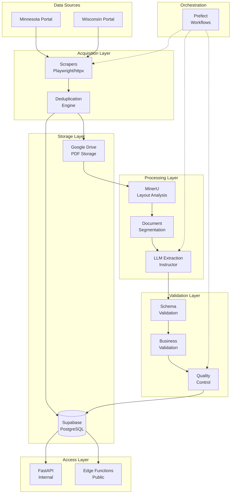
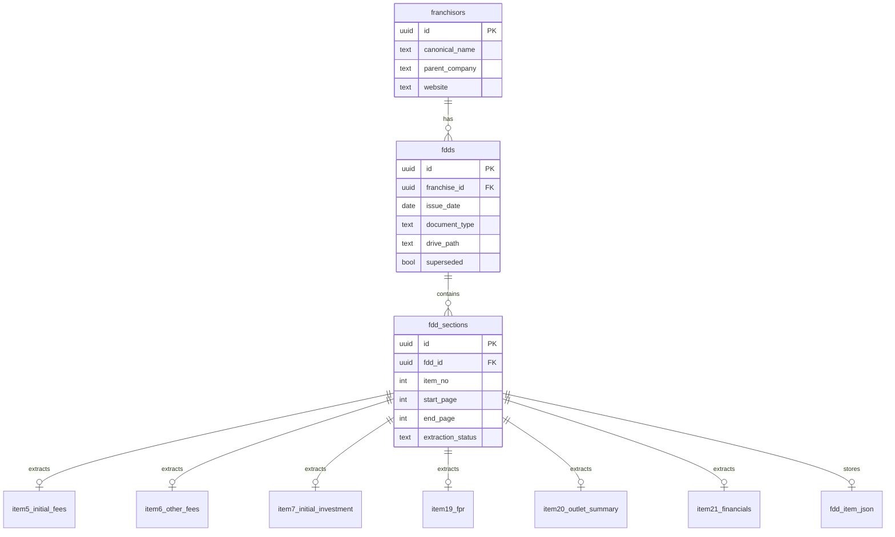
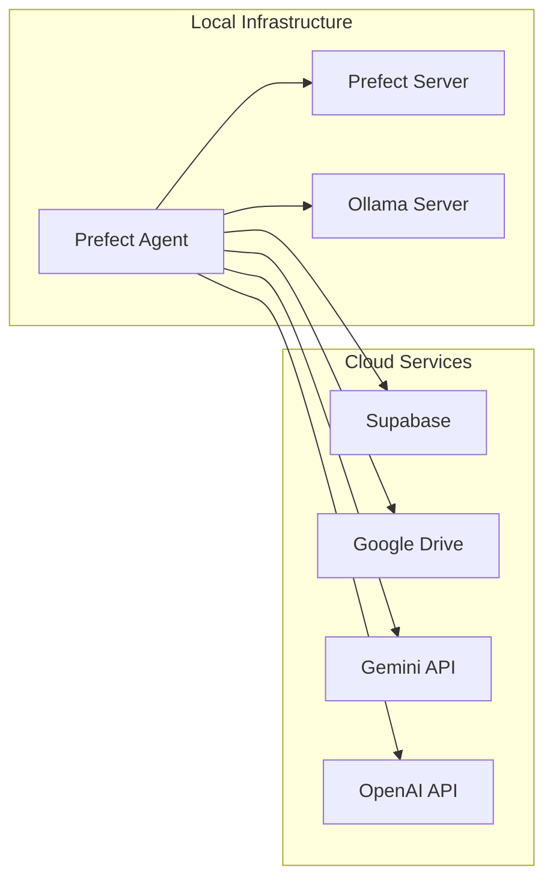

# FDD Pipeline Architecture

## System Overview

The FDD Pipeline is a distributed document processing system designed to handle the complete lifecycle of Franchise Disclosure Documents - from acquisition through state portals to structured data extraction and storage. The architecture emphasizes reliability, scalability, and data quality through multi-stage validation.

## High-Level Architecture



## Component Architecture

### 1. Acquisition Layer

**Purpose**: Automated collection of FDD documents from state regulatory portals.

**Components**:
- **State-Specific Scrapers**: Custom Playwright scripts for each portal
- **Metadata Extractors**: Parse filing information during scrape
- **Deduplication Engine**: Prevent reprocessing of identical documents

**Key Design Decisions**:
- Playwright over Selenium for better reliability and performance
- State-specific scrapers rather than generic solution due to portal differences
- Immediate upload to Google Drive to avoid local storage

### 2. Storage Layer

**Purpose**: Centralized, cloud-based storage for documents and structured data.

**Components**:
- **Google Drive**: Document binary storage with folder hierarchy
- **Supabase PostgreSQL**: Structured data, metadata, and processing state

**Storage Strategy**:
```
Google Drive Structure:
/fdds/
  /{source}/           # MN, WI
    /{franchise_slug}/
      /{year}/
        /{document_type}/
          original.pdf
          /segments/
            section_00_intro.pdf
            section_01.pdf
            ...
            section_23.pdf
            section_24_appendix.pdf
```

### 3. Processing Layer

**Purpose**: Transform unstructured PDFs into structured, queryable data.

**Pipeline Stages**:
1. **Layout Analysis** (MinerU API)
   - Detect tables, text blocks, titles
   - Generate document structure JSON
   
2. **Section Identification**
   - Rule-based header detection
   - Fuzzy matching for non-standard formats
   - Page range calculation
   
3. **Document Segmentation**
   - Split into 25 individual PDFs
   - Maintain page number mapping
   
4. **LLM Extraction**
   - Section-specific prompts
   - Structured output via Instructor
   - Multi-model fallback strategy

### 4. Validation Layer

**Purpose**: Ensure data quality and consistency before storage.

**Validation Tiers**:

| Tier | Description | Examples | Action on Failure |
|------|-------------|----------|-------------------|
| Schema | Pydantic model validation | Required fields, type checking | Retry extraction |
| Business | Domain-specific rules | Totals matching, date logic | Flag for review |
| Quality | Completeness checks | Missing sections, OCR quality | Log warning |

### 5. Data Model

**Core Entities**:



### 6. Orchestration Layer

**Purpose**: Coordinate pipeline execution and handle failures.

**Prefect Flows**:
```python
# High-level flow structure
@flow
def process_state_fdds(state: str):
    # Acquisition
    new_docs = scrape_state_portal(state)
    
    # Deduplication
    unique_docs = deduplicate(new_docs)
    
    # Processing (mapped for parallelism)
    segmented = segment_documents.map(unique_docs)
    extracted = extract_sections.map(segmented)
    
    # Validation & Storage
    validated = validate_data.map(extracted)
    store_results(validated)
```

**Scheduling**:
- Weekly runs for each state portal
- Retry logic: 3 attempts with exponential backoff
- Email alerts on failure

## Technology Decisions

### Why Google Drive?

**Pros**:
- No storage limits for workspace accounts
- Built-in versioning and audit trail
- Simple API for remote-only operations
- Cost-effective for large PDFs

**Cons**:
- API rate limits require careful handling
- No native database features

**Alternative Considered**: S3
- Better for programmatic access but higher complexity

### Why Supabase?

**Pros**:
- PostgreSQL with batteries included
- Built-in auth and RLS
- Edge Functions for API layer
- Real-time subscriptions (future use)

**Cons**:
- Vendor lock-in for some features
- Limited to PostgreSQL

**Alternative Considered**: Raw PostgreSQL + custom API
- More control but significantly more infrastructure

### Why Prefect?

**Pros**:
- Python-native with decorators
- Excellent observability
- Dynamic task mapping
- Local and cloud deployment options

**Cons**:
- Relatively new (v2)
- Smaller community than Airflow

**Alternative Considered**: Airflow
- More mature but heavier and more complex

### LLM Strategy

**Model Selection Logic**:
```python
def select_model(section: int, complexity: str) -> str:
    # Simple structured data (tables)
    if section in [5, 6, 7] and complexity == "low":
        return "ollama:phi3-mini"  # Fast, local
    
    # Complex narratives
    elif section in [19, 21] or complexity == "high":
        return "gemini-pro-2.5"  # Best accuracy
    
    # Default
    else:
        return "ollama:llama3-8b"  # Balanced
```

**Fallback Chain**:
1. Primary model (based on selection)
2. Secondary model (next tier up)
3. OpenAI GPT-4 (highest cost, best reliability)

## Security Model

### Authentication & Authorization
- **Supabase RLS**: Row-level security for data access
- **Service Keys**: Separate keys for different components
- **API Keys**: Stored in environment, never in code

### Data Privacy
- **PII Handling**: No PII extracted or stored
- **Document Access**: Service account with minimal permissions
- **Audit Trail**: All operations logged with user/service identity

### Network Security
- **HTTPS Only**: All external communications encrypted
- **Private Endpoints**: Internal APIs not exposed publicly
- **Rate Limiting**: Implemented at Edge Function layer

## Scalability Considerations

### Horizontal Scaling
- **Scrapers**: Multiple Prefect agents can run in parallel
- **Processing**: Task mapping allows parallel document processing
- **LLM Calls**: Async operations with connection pooling

### Vertical Scaling
- **Database**: Supabase auto-scales with usage
- **Storage**: Google Drive has no practical limits
- **Compute**: Local Prefect agents can be upgraded as needed

### Bottlenecks & Mitigation
1. **MinerU API Rate Limits**
   - Solution: Queue with rate limiting
   - Future: Self-hosted MinerU

2. **LLM API Costs**
   - Solution: Local models for simple tasks
   - Future: Fine-tuned models

3. **Database Connections**
   - Solution: Connection pooling
   - Future: Read replicas

## Monitoring & Observability

### Metrics Tracked
- Document processing rate
- Section extraction success rate
- LLM token usage by model
- Validation failure reasons
- End-to-end latency

### Logging Strategy
```python
# Structured logging example
logger.info("section_extracted", 
    section_id=section.id,
    item_no=section.item_no,
    model_used=model_name,
    tokens_used=response.usage.total_tokens,
    extraction_time=elapsed_time
)
```

### Alerting Rules
- Pipeline failure (any critical error)
- Extraction success rate < 95%
- Processing time > 2x average
- API rate limit approaching

## Future Architecture Considerations

### Phase 2 Enhancements
- **Streaming Processing**: Process documents as they arrive
- **Multi-Region**: Replicate to other cloud regions
- **API Gateway**: Kong or similar for advanced routing

### Phase 3 Vision
- **ML Pipeline**: Custom models for extraction
- **Real-time Updates**: WebSocket subscriptions
- **Data Warehouse**: Dedicated analytics infrastructure

## Development & Deployment

### Local Development
```bash
# Minimum setup
- Prefect Server (local)
- PostgreSQL (Docker)
- Ollama (for local LLMs)
- Google Drive (service account)
```

### Deployment Architecture


## Key Architecture Principles

1. **Idempotency**: All operations can be safely retried
2. **Observability**: Every action is logged and measurable
3. **Fail-Safe**: Graceful degradation with fallback options
4. **Modularity**: Components can be upgraded independently
5. **Cost-Aware**: Use cheapest option that meets requirements

---

For detailed component documentation, see the `/docs/01_architecture/` directory.