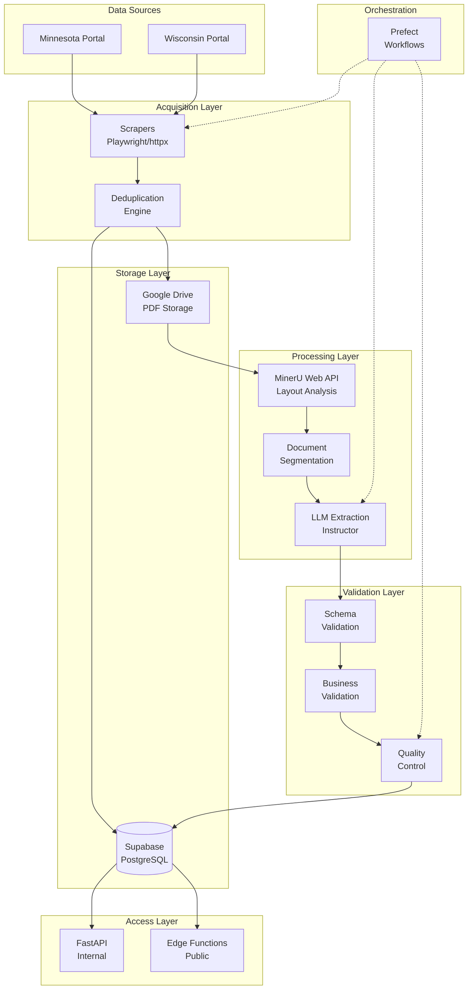
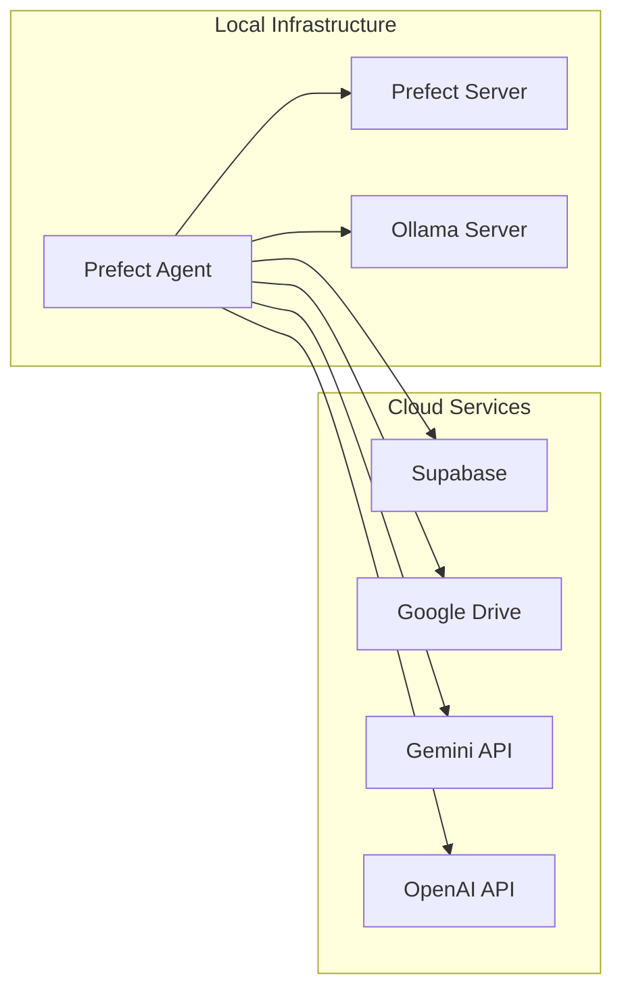

# FDD Pipeline Architecture

> **⚠️ ARCHITECTURAL ALERT**: The system is currently experiencing critical import mismatches that prevent workflow orchestration. This document reflects both the intended architecture and current implementation state.

## System Overview

The FDD Pipeline is a distributed document processing system designed to handle the complete lifecycle of Franchise Disclosure Documents - from acquisition through state portals to structured data extraction and storage. The architecture emphasizes reliability, scalability, and data quality through multi-stage validation.

**Current State**: Most components are functional individually, but the unified pipeline execution is blocked by architectural inconsistencies between expected and actual module structures.

## High-Level Architecture



## Component Architecture

### 1. Acquisition Layer

**Purpose**: Automated collection of FDD documents from state regulatory portals.

**Current Status**: ⚠️ **Partially Functional** - Components work individually, orchestration broken

**Components**:
- **State-Specific Scrapers**: Custom Playwright scripts for each portal
  - ✅ **Working**: `franchise_scrapers/MN_Scraper.py`, `WI_Scraper.py`
  - ✅ **New**: `franchise_scrapers/MN_Scraper_DB.py`, `WI_Scraper_DB.py` (database integrated)
  - ❌ **Expected**: `scrapers/states/minnesota.py`, `wisconsin.py` (doesn't exist)
- **Metadata Extractors**: Parse filing information during scrape (✅ functional)
- **Deduplication Engine**: Prevent reprocessing of identical documents (✅ functional)
- **Workflow Integration**: Prefect orchestration (❌ broken due to import issues)

**Critical Issue**: 
```python
# These imports FAIL in workflows/state_configs.py:4-5
from scrapers.states.minnesota import MinnesotaScraper  # Module doesn't exist
from scrapers.states.wisconsin import WisconsinScraper   # Module doesn't exist
```

**Key Design Decisions**:
- Playwright over Selenium for better reliability and performance
- State-specific scrapers rather than generic solution due to portal differences
- Immediate upload to Google Drive to avoid local storage
- **Architecture transition incomplete**: Multiple scraper implementations coexist

### 2. Storage Layer

**Purpose**: Centralized, cloud-based storage for documents and structured data.

**Current Status**: ✅ **Fully Functional** - All storage operations working

**Components**:
- **Google Drive**: Document binary storage with folder hierarchy (✅ functional)
  - Multiple authentication methods (OAuth2, Service Account)
  - Automatic folder organization by state/franchise
  - Resumable uploads for large files
- **Supabase PostgreSQL**: Structured data, metadata, and processing state (✅ functional)
  - 161 Pydantic models for complete data structure
  - Normalized tables for Items 5, 6, 7, 19, 20, 21
  - JSON storage for flexible item data
  - Full audit trail and document lineage

**Storage Strategy**:
```
Google Drive Structure:
/fdds/
  /{source}/           # MN, WI
    /{franchise_slug}/
      /{year}/
        /{document_type}/
          original.pdf
          /segments/
            section_00_intro.pdf
            section_01.pdf
            ...
            section_23.pdf
            section_24_appendix.pdf
```

### 3. Processing Layer

**Purpose**: Transform unstructured PDFs into structured, queryable data.

**Current Status**: ✅ **Fully Functional** - All processing components working individually

**Pipeline Stages**:
1. **Layout Analysis** (MinerU Web API) ✅
   - Browser-based authentication workflow via Playwright
   - Cloud-based PDF processing (no local GPU required)
   - Advanced table and structure detection
   - Returns structured JSON and markdown
   - Located in `processing/mineru/mineru_web_api.py`
   
2. **Section Identification** ✅
   - Enhanced detection with Claude LLM (`processing/segmentation/enhanced_detector.py`)
   - Rule-based header detection with fuzzy matching
   - Confidence scoring for ambiguous sections
   - Page range calculation with overlap handling
   
3. **Document Segmentation** ✅
   - Split into 25 individual PDFs (Items 0-23 + appendix)
   - Maintain page number mapping via `fdd_sections` table
   - Handle multi-page sections with proper boundaries
   
4. **LLM Extraction** ✅
   - Section-specific prompts loaded from YAML (`prompts/` directory)
   - Structured output via Instructor framework (`processing/extraction/llm_extraction.py`)
   - Multi-model routing: Gemini (primary), OpenAI (fallback), Ollama (local)
   - Automatic retry with validation and exponential backoff

### 4. Validation Layer

**Purpose**: Ensure data quality and consistency before storage.

**Current Status**: ✅ **Fully Functional** - All validation tiers implemented

**Validation Tiers**:

| Tier | Description | Examples | Action on Failure | Implementation |
|------|-------------|----------|-------------------|----------------|
| Schema | Pydantic model validation | Required fields, type checking | Retry extraction | `validation/schema_validation.py` ✅ |
| Business | Domain-specific rules | Totals matching, date logic | Flag for review | `validation/business_rules.py` ✅ |
| Quality | Completeness checks | Missing sections, OCR quality | Log warning | Integrated in extraction flow ✅ |

### 5. Data Model

**Current Status**: ✅ **Comprehensive** - 161 Pydantic models covering all FDD data structures

**Core Entities**:


### 6. Orchestration Layer

**Purpose**: Coordinate pipeline execution and handle failures.

**Current Status**: ❌ **Broken** - Import mismatches prevent flow execution

**Prefect Flows**:
```python
# High-level flow structure in workflows/base_state_flow.py
@flow
def process_state_fdds(state: str):
    # ❌ FAILS HERE: Cannot import scrapers
    from scrapers.states.minnesota import MinnesotaScraper  # Module doesn't exist
    
    # Acquisition
    new_docs = scrape_state_portal(state)  # ❌ Broken
    
    # Processing components work individually
    segmented = segment_documents.map(unique_docs)  # ✅ Would work
    extracted = extract_sections.map(segmented)     # ✅ Would work
    validated = validate_data.map(extracted)        # ✅ Would work
```

**Critical Issues**:
- `workflows/state_configs.py` imports non-existent scrapers
- `workflows/base_state_flow.py` cannot instantiate scraper classes
- Prefect flows cannot be deployed due to import errors

**Functional Workarounds**:
- Individual scrapers can be run manually: `python franchise_scrapers/MN_Scraper.py`
- Processing tasks work via direct API calls
- Database operations are fully functional

**Scheduling**:
- ❌ Weekly automated runs currently impossible
- Retry logic: ✅ Implemented in individual components
- Email alerts: ✅ Configured but not triggered due to no automated runs

## Technology Decisions

### Why MinerU Web API?

**Pros**:
- State-of-the-art PDF layout analysis
- No local GPU/compute requirements
- Handles complex table structures
- Consistent results across documents

**Cons**:
- Requires browser authentication
- Rate limits on free tier
- Network dependency

**Alternative Considered**: Local PDF processing
- More control but significantly worse accuracy

### Why Google Drive?

**Pros**:
- No storage limits for workspace accounts
- Built-in versioning and audit trail
- Simple API for remote-only operations
- Cost-effective for large PDFs

**Cons**:
- API rate limits require careful handling
- No native database features

**Alternative Considered**: S3
- Better for programmatic access but higher complexity

### Why Supabase?

**Pros**:
- PostgreSQL with batteries included
- Built-in auth and RLS
- Edge Functions for API layer
- Real-time subscriptions (future use)

**Cons**:
- Vendor lock-in for some features
- Limited to PostgreSQL

**Alternative Considered**: Raw PostgreSQL + custom API
- More control but significantly more infrastructure

### Why Prefect?

**Pros**:
- Python-native with decorators
- Excellent observability
- Dynamic task mapping
- Local and cloud deployment options

**Cons**:
- Relatively new (v2)
- Smaller community than Airflow

**Alternative Considered**: Airflow
- More mature but heavier and more complex

### LLM Strategy

**Current Implementation**: ✅ **Fully Functional** - Multi-model routing with intelligent fallback

**Model Selection Logic** (`processing/extraction/llm_extraction.py`):
```python
def select_model(section: int, complexity: str) -> str:
    # Implementation uses Gemini as primary for all extractions
    # with OpenAI as fallback and Ollama for development/testing
    
    # Current routing (can be enhanced):
    return "gemini-1.5-pro"  # Primary model
```

**Fallback Chain** (✅ Implemented):
1. **Gemini 1.5 Pro** - Primary model for all extractions
2. **OpenAI GPT-4** - Fallback when Gemini fails/rate limited  
3. **Ollama Local Models** - Development and privacy-preserving processing

**Features**:
- ✅ Automatic retry with exponential backoff
- ✅ Token usage tracking and cost monitoring
- ✅ Model-specific prompt optimization
- ✅ Structured output via Instructor framework
- ✅ Validation-driven re-extraction

## Security Model

### Authentication & Authorization
- **Supabase RLS**: Row-level security for data access
- **Service Keys**: Separate keys for different components
- **API Keys**: Stored in environment, never in code

### Data Privacy
- **PII Handling**: No PII extracted or stored
- **Document Access**: Service account with minimal permissions
- **Audit Trail**: All operations logged with user/service identity

### Network Security
- **HTTPS Only**: All external communications encrypted
- **Private Endpoints**: Internal APIs not exposed publicly
- **Rate Limiting**: Implemented at Edge Function layer

## Scalability Considerations

### Horizontal Scaling
- **Scrapers**: Multiple Prefect agents can run in parallel
- **Processing**: Task mapping allows parallel document processing
- **LLM Calls**: Async operations with connection pooling

### Vertical Scaling
- **Database**: Supabase auto-scales with usage
- **Storage**: Google Drive has no practical limits
- **Compute**: Local Prefect agents can be upgraded as needed

### Bottlenecks & Mitigation
1. **MinerU API Rate Limits**
   - Solution: Queue with rate limiting
   - Authentication caching for session reuse
   - Future: Premium tier or self-hosted option

2. **LLM API Costs**
   - Solution: Ollama for simple tasks
   - Model routing based on complexity
   - Future: Fine-tuned models

3. **Database Connections**
   - Solution: Connection pooling via Supabase
   - Batch operations where possible
   - Future: Read replicas

4. **Browser Automation Stability**
   - Solution: Retry logic with exponential backoff
   - Headless mode for production
   - Future: API-only authentication

## Monitoring & Observability

### Metrics Tracked
- Document processing rate
- Section extraction success rate
- LLM token usage by model
- Validation failure reasons
- End-to-end latency

### Logging Strategy
```python
# Structured logging example
logger.info("section_extracted", 
    section_id=section.id,
    item_no=section.item_no,
    model_used=model_name,
    tokens_used=response.usage.total_tokens,
    extraction_time=elapsed_time
)
```

### Alerting Rules
- Pipeline failure (any critical error)
- Extraction success rate < 95%
- Processing time > 2x average
- API rate limit approaching

## Future Architecture Considerations

### Phase 2 Enhancements
- **Streaming Processing**: Process documents as they arrive
- **Multi-Region**: Replicate to other cloud regions
- **API Gateway**: Kong or similar for advanced routing

### Phase 3 Vision
- **ML Pipeline**: Custom models for extraction
- **Real-time Updates**: WebSocket subscriptions
- **Data Warehouse**: Dedicated analytics infrastructure

## Development & Deployment

### Local Development
```bash
# Minimum setup
- Prefect Server (local)
- PostgreSQL (Docker)
- Ollama (for local LLMs)
- Google Drive (service account)
```

### Deployment Architecture


## Current Architectural Issues & Resolution

### Critical Import Mismatches

**Problem**: Multiple files expect a unified `scrapers/` module structure that doesn't exist:

```python
# Failing imports across the codebase:
from scrapers.states.minnesota import MinnesotaScraper      # ❌ Module missing
from scrapers.states.wisconsin import WisconsinScraper     # ❌ Module missing
from scrapers.base.base_scraper import BaseScraper        # ❌ Module missing
```

**Root Cause**: Architectural transition was started but not completed. The codebase contains:
- ✅ **Working**: Standalone scrapers in `franchise_scrapers/`
- ❌ **Expected**: Modular scrapers in `scrapers/states/`
- 🔄 **Partial**: Subdirectories in `franchise_scrapers/mn/`, `franchise_scrapers/wi/`

### Resolution Paths

**Option 1: Complete the Refactoring**
1. Create `scrapers/` module structure
2. Move functionality from `franchise_scrapers/` to `scrapers/`
3. Implement `BaseScraper` abstract class
4. Update all imports across the codebase

**Option 2: Update Imports to Current Structure**
1. Change imports in `workflows/` to use `franchise_scrapers`
2. Update test files to match current implementation
3. Modify configuration to use existing scrapers

**Option 3: Consolidate to New Database-Integrated Scrapers**
1. Complete the `MN_Scraper_DB.py`, `WI_Scraper_DB.py` implementations
2. Update workflows to use these new versions
3. Deprecate standalone versions

### Immediate Next Steps

1. **Quick Fix** (1-2 hours):
   ```python
   # In workflows/state_configs.py, change:
   from scrapers.states.minnesota import MinnesotaScraper
   # To:
   from franchise_scrapers.MN_Scraper_DB import MNScraperDB as MinnesotaScraper
   ```

2. **Test Restoration** (2-4 hours):
   - Update test imports to match current structure
   - Fix test cases for existing scraper implementations

3. **Full Orchestration** (1-2 days):
   - Complete workflow integration with existing scrapers
   - Deploy Prefect flows for automated execution

## Key Architecture Principles

1. **Idempotency**: All operations can be safely retried ✅
2. **Observability**: Every action is logged and measurable ✅
3. **Fail-Safe**: Graceful degradation with fallback options ✅
4. **Modularity**: Components can be upgraded independently ⚠️ (blocked by imports)
5. **Cost-Aware**: Use cheapest option that meets requirements ✅

## System Health Summary

| Component | Status | Notes |
|-----------|--------|--------|
| Individual Scrapers | ✅ Functional | Manual execution works |
| Document Processing | ✅ Functional | All stages working |
| Data Models | ✅ Functional | 161 models complete |
| Database Operations | ✅ Functional | Full CRUD operations |
| API Layer | ✅ Functional | FastAPI endpoints working |
| Workflow Orchestration | ❌ Broken | Import issues prevent deployment |
| Automated Scheduling | ❌ Broken | Depends on workflow fixes |

---

For detailed component documentation, see the individual documentation files in the `/docs/` directory.