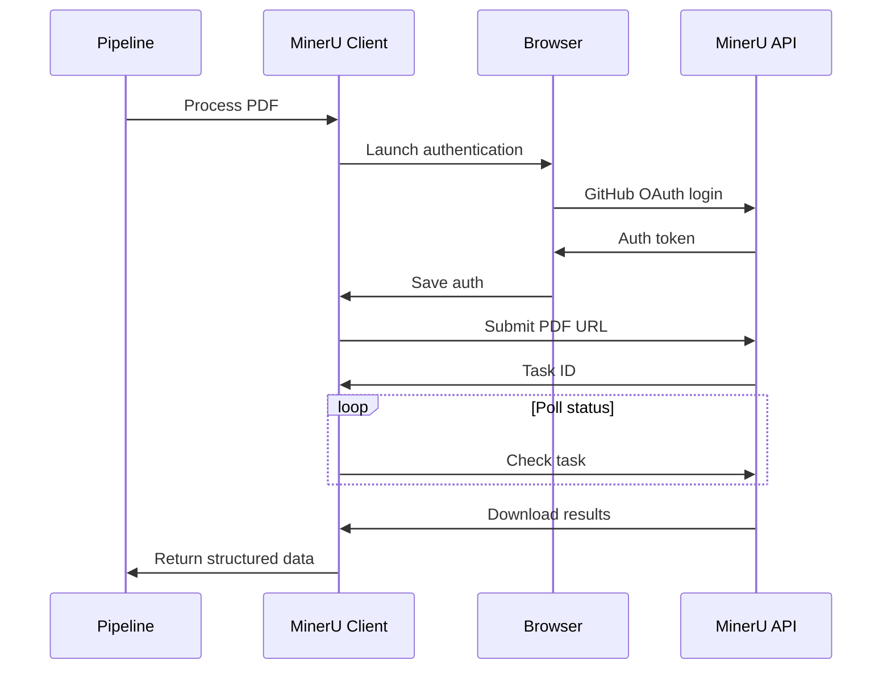

# MinerU Web API Integration Guide

## Overview

MinerU is a state-of-the-art PDF processing service that provides advanced layout analysis, table detection, and content extraction capabilities. The FDD Pipeline integrates with MinerU's Web API to process complex PDF documents before LLM extraction.

## How It Works

### Architecture



### Authentication Flow

MinerU uses GitHub OAuth for authentication. The integration handles this automatically:

1. **First Run**: Opens browser for GitHub login
2. **Subsequent Runs**: Uses saved authentication from `mineru_auth.json`
3. **Token Refresh**: Automatically handled when expired

## Setup

### 1. Install Dependencies

```bash
# Install Playwright for browser automation
playwright install chromium

# Python dependencies are included in main requirements
uv sync
```

### 2. Configuration

The MinerU client is configured through environment variables:

```bash
# In .env file
MINERU_AUTH_FILE=mineru_auth.json  # Where to store auth credentials
```

### 3. First-Time Authentication

When running for the first time:

```python
from src.MinerU.mineru_web_api import MinerUAPI

# Create client
api = MinerUAPI()

# Login - will open browser
api.login(use_saved=False)  # Force new login
```

## Usage

### Basic PDF Processing

```python
from src.MinerU.mineru_web_api import MinerUAPI

# Initialize client
api = MinerUAPI()

# Login (uses saved auth if available)
api.login(use_saved=True)

# Process a PDF
pdf_url = "https://example.com/path/to/fdd.pdf"
results = api.process_pdf(pdf_url, wait_time=300)

# Results contain:
# - markdown: Extracted text in markdown format
# - json: Structured layout information
# - filename: Original filename
```

### Integration with Pipeline

The pipeline automatically uses MinerU through the `mineru_processing` task:

```python
from tasks.mineru_processing import process_with_mineru

# Process PDF and get structured data
mineru_data = await process_with_mineru(
    pdf_path="/path/to/local.pdf",
    drive_file_id="google_drive_id"
)
```

## Output Format

### Markdown Output

The markdown file contains:
- Extracted text with formatting preserved
- Table structures converted to markdown tables
- Headers and sections identified
- Page breaks marked

Example:
```markdown
# FRANCHISE DISCLOSURE DOCUMENT

## Item 1: THE FRANCHISOR AND ANY PARENTS, PREDECESSORS AND AFFILIATES

The franchisor is Example Franchise LLC...

### Table 1: Initial Investment

| Type | Amount | When Due |
|------|--------|----------|
| Initial Fee | $45,000 | At signing |
| Equipment | $50,000-$75,000 | Before opening |
```

### JSON Output

The JSON file contains detailed layout information:

```json
{
  "pages": [
    {
      "page_no": 1,
      "blocks": [
        {
          "type": "title",
          "text": "FRANCHISE DISCLOSURE DOCUMENT",
          "bbox": [100, 100, 500, 150]
        },
        {
          "type": "table",
          "cells": [...],
          "bbox": [100, 200, 500, 400]
        }
      ]
    }
  ],
  "metadata": {
    "total_pages": 250,
    "extracted_at": "2024-01-15T10:30:00Z"
  }
}
```

## Error Handling

### Common Issues and Solutions

1. **Authentication Failures**
   ```python
   # Delete saved auth and re-authenticate
   import os
   os.remove("mineru_auth.json")
   api.login(use_saved=False)
   ```

2. **Rate Limiting**
   - MinerU has rate limits on the free tier
   - The client automatically handles 429 errors with backoff
   - Consider upgrading to paid tier for production use

3. **Processing Timeouts**
   ```python
   # Increase wait time for large documents
   results = api.process_pdf(pdf_url, wait_time=600)  # 10 minutes
   ```

4. **Network Issues**
   - The client includes retry logic for transient failures
   - Check proxy settings if behind corporate firewall

## Advanced Configuration

### Custom Headers

```python
# Add custom headers if needed
api.session.headers.update({
    "X-Custom-Header": "value"
})
```

### Proxy Support

```python
# Configure proxy for corporate environments
api.session.proxies = {
    "http": "http://proxy.company.com:8080",
    "https": "http://proxy.company.com:8080"
}
```

### Debug Mode

Enable debug logging:

```python
import logging
logging.basicConfig(level=logging.DEBUG)

# Or set in environment
DEBUG=true python main.py
```

## Performance Optimization

### Caching

The client includes a 15-minute cache for processed documents:

```python
# Process same PDF multiple times - uses cache
results1 = api.process_pdf(pdf_url)  # Processes
results2 = api.process_pdf(pdf_url)  # From cache
```

### Batch Processing

For multiple PDFs, process in parallel:

```python
import asyncio
from concurrent.futures import ThreadPoolExecutor

async def process_batch(pdf_urls):
    with ThreadPoolExecutor(max_workers=3) as executor:
        tasks = [
            asyncio.get_event_loop().run_in_executor(
                executor, api.process_pdf, url
            )
            for url in pdf_urls
        ]
        results = await asyncio.gather(*tasks)
    return results
```

## Monitoring

### Logging

All MinerU operations are logged:

```
2024-01-15 10:30:00 INFO: Processing PDF: example.pdf
2024-01-15 10:30:05 INFO: Task ID: 123e4567-e89b-12d3-a456-426614174000
2024-01-15 10:30:15 INFO: Status: processing
2024-01-15 10:31:00 INFO: Status: done
2024-01-15 10:31:05 INFO: Downloaded: example.md (2.5MB)
```

### Metrics

Track processing metrics:

```python
from utils.extraction_monitoring import ExtractionMonitor

monitor = ExtractionMonitor()
monitor.record_mineru_processing(
    pdf_path=pdf_path,
    processing_time=elapsed_time,
    success=True,
    output_size=len(markdown_content)
)
```

## Troubleshooting

### Debug Checklist

1. **Check Authentication**
   ```bash
   # Verify auth file exists and is valid
   cat mineru_auth.json | jq '.cookies[] | select(.name=="uaa-token")'
   ```

2. **Test Connection**
   ```python
   # Simple connectivity test
   response = api.session.get("https://mineru.net/api/v4/tasks")
   print(f"Status: {response.status_code}")
   ```

3. **Verify Browser Installation**
   ```bash
   # Check Playwright browsers
   playwright show-browsers
   ```

### Common Error Messages

| Error | Cause | Solution |
|-------|-------|----------|
| "Not logged in" | Missing or expired auth | Re-authenticate with `api.login()` |
| "Task timeout" | Large PDF or slow processing | Increase `wait_time` parameter |
| "Rate limit exceeded" | Too many requests | Add delays or upgrade account |
| "Browser launch failed" | Missing Chromium | Run `playwright install chromium` |

## Best Practices

1. **Authentication Management**
   - Store `mineru_auth.json` securely
   - Don't commit auth file to version control
   - Refresh auth tokens periodically

2. **Error Handling**
   - Always wrap API calls in try-except blocks
   - Implement exponential backoff for retries
   - Log all errors for debugging

3. **Performance**
   - Process PDFs in batches when possible
   - Use caching for frequently accessed documents
   - Monitor rate limits and adjust accordingly

4. **Production Deployment**
   - Use headless browser mode
   - Set up proper logging and monitoring
   - Consider paid tier for higher limits

## API Limitations

### Free Tier
- Rate limit: 10 PDFs per hour
- Max file size: 50MB
- Processing timeout: 5 minutes
- No priority queue

### Paid Tiers
- Higher rate limits
- Larger file sizes
- Priority processing
- API-only authentication (no browser)

## Future Enhancements

1. **Direct API Integration**: Remove browser dependency when API keys are available
2. **Local Deployment**: Self-hosted MinerU option for sensitive documents
3. **Webhook Support**: Real-time notifications instead of polling
4. **Batch API**: Process multiple PDFs in single request