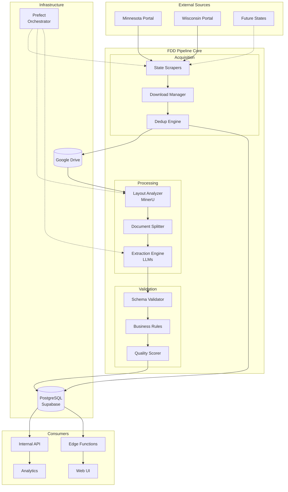
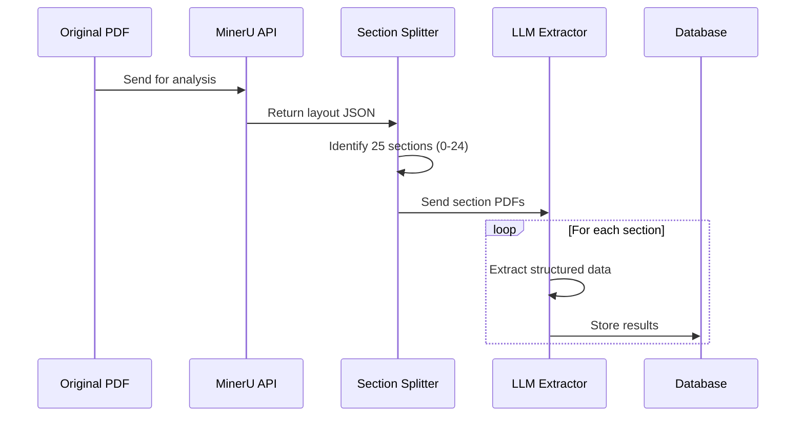
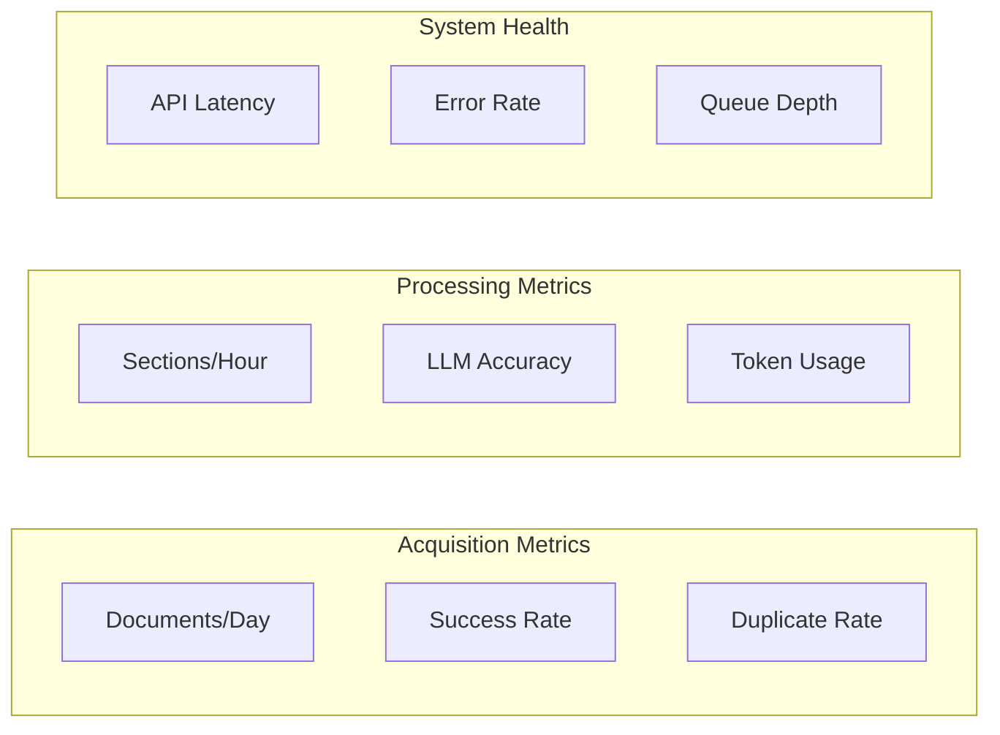

# System Overview

> **⚠️ CRITICAL STATUS**: The system is currently in a transitional architectural state with import mismatches that prevent workflow orchestration from functioning. See [Architecture Issues](#critical-architecture-issues) below.

## Executive Summary

The FDD Pipeline is an automated document intelligence system that transforms unstructured Franchise Disclosure Documents (FDDs) into structured, queryable data. It combines web scraping, document analysis, AI-powered extraction, and cloud storage to create a comprehensive franchise intelligence platform.

**Current Status**: Core components are functional individually, but workflow orchestration is blocked by architectural inconsistencies between expected `scrapers/` module structure and actual `franchise_scrapers/` implementation.

## System Goals

### Primary Objectives
1. **Automated Acquisition**: Continuously monitor and download FDDs from state regulatory portals
2. **Intelligent Processing**: Extract structured data from 25 FDD sections (Intro + Items 1-23 + Appendix)
3. **Data Quality**: Ensure high accuracy through multi-tier validation
4. **Scalability**: Handle thousands of documents efficiently
5. **Accessibility**: Provide clean APIs for downstream applications

### Key Metrics
- **Processing Throughput**: 100+ FDDs per day (target - currently limited by architectural issues)
- **Extraction Accuracy**: >95% for structured sections
- **System Uptime**: 99.5% availability
- **End-to-End Latency**: <10 minutes per document

## High-Level Architecture



## Critical Architecture Issues

### 🚨 Import Mismatches
Multiple files expect a `scrapers/` module that doesn't exist:
- `workflows/state_configs.py:4-5` - imports `MinnesotaScraper`, `WisconsinScraper`
- `workflows/base_state_flow.py` - expects modular scraper architecture
- `tasks/document_metadata.py` - broken scraper imports
- Multiple test files in `tests/scrapers/` - test non-existent scrapers

**Impact**: Workflow orchestration cannot function, tests fail

### 🔄 Dual Scraper Implementations
- **Working**: Standalone scripts in `franchise_scrapers/` (`MN_Scraper.py`, `WI_Scraper.py`)
- **New**: Database-integrated versions (`MN_Scraper_DB.py`, `WI_Scraper_DB.py`)
- **Planned**: Modular packages in subdirectories (`mn/`, `wi/`) - unused
- **Expected**: Module structure in non-existent `scrapers/` directory

## Core Components

### 1. Acquisition Subsystem

**Purpose**: Automated collection of FDD documents from various sources.

**Current Status**: ⚠️ **Partially Functional** - Individual scrapers work, orchestration broken

**Key Components**:
- **State-Specific Scrapers**: Custom Playwright scripts per portal (functional)
- **Download Manager**: Handles file downloads with retry logic (functional)
- **Deduplication Engine**: Prevents duplicate processing using fuzzy matching (functional)
- **Workflow Orchestration**: Prefect-based automation (**broken due to import issues**)

**Data Flow**:
1. Scrapers poll state portals on schedule (**manual execution only**)
2. Extract metadata and download URLs (functional)
3. Download PDFs directly to Google Drive (functional)
4. Check for duplicates using embeddings (functional)
5. Register new documents in database (functional)

### 2. Document Processing Subsystem

**Purpose**: Transform PDFs into structured, section-based data.

**Current Status**: ✅ **Functional** - All components working individually

**Processing Pipeline**:



**Key Technologies**:
- **MinerU Web API**: Cloud-based AI-powered layout analysis (functional)
- **Enhanced Section Detection**: Claude-based + rule-based hybrid (functional)
- **LLM Routing**: Multi-model selection (Gemini/OpenAI/Ollama) (functional)

### 3. Validation Subsystem

**Purpose**: Ensure data quality and consistency.

**Current Status**: ✅ **Functional** - All validation layers implemented

**Validation Layers**:

| Layer | Purpose | Examples | Action |
|-------|---------|----------|--------|
| Schema | Structure validation | Required fields, types | Retry/Fail |
| Business | Domain rules | Sum validations, date logic | Flag/Review |
| Quality | Completeness | Missing data, OCR quality | Score/Alert |

### 4. Storage Architecture

**Current Status**: ✅ **Fully Functional** - All storage components working

**Document Storage (Google Drive)**:
```
/fdds/
├── /raw/                  # Original PDFs
│   ├── /mn/
│   └── /wi/
├── /processed/            # Segmented PDFs
│   └── /{franchise_id}/
│       └── /{year}/
│           ├── section_01.pdf
│           └── ...
└── /archive/              # Old/superseded
```

**Data Storage (PostgreSQL/Supabase)**:
- ✅ **161 Pydantic models** for complete FDD data structure
- ✅ **Normalized tables** for Items 5, 6, 7, 19, 20, 21 with detailed schemas
- ✅ **JSON storage** for Items 1-4, 8-18, 22-24 via `fdd_item_json` table
- ✅ **Full audit trail** with `scrape_metadata` and `pipeline_logs`
- ✅ **Document versioning** with supersession tracking

## System Interactions

### Synchronous Operations
1. **API Queries**: Real-time data access
2. **Status Checks**: Pipeline monitoring
3. **Manual Uploads**: Direct document submission

### Asynchronous Operations
1. **Scheduled Scraping**: Weekly portal checks (**currently manual due to orchestration issues**)
2. **Document Processing**: Queue-based extraction (functional via individual task execution)
3. **Batch Validation**: Nightly quality checks (functional)

## Security & Compliance

### Data Security
- **Encryption**: TLS for all external communications
- **Authentication**: Service accounts with minimal permissions
- **Access Control**: Row-level security in database
- **Audit Trail**: Complete operation logging

### Compliance Considerations
- **Data Retention**: 7-year archive policy
- **Privacy**: No PII extraction or storage
- **Licensing**: Respect portal terms of service
- **Right to Deletion**: Support for data removal requests

## Scalability Design

### Horizontal Scaling Points
- **Scrapers**: Multiple agents per state
- **Processing**: Parallel section extraction
- **API**: Load-balanced endpoints

### Vertical Scaling Options
- **Database**: Auto-scaling with Supabase
- **LLM Calls**: Rate limiting and queuing
- **Storage**: Unlimited Google Drive capacity

### Performance Optimizations
1. **Caching**: Embedding vectors for deduplication
2. **Batching**: Group similar extraction tasks
3. **Compression**: Archive old documents
4. **Indexing**: Optimized database queries

## Monitoring & Observability

### Key Metrics Dashboard



### Alerting Triggers
- Pipeline failures
- Extraction accuracy < 95%
- API response time > 2s
- Storage usage > 80%

## Disaster Recovery

### Backup Strategy
- **Database**: Daily automated backups
- **Documents**: Google Drive versioning
- **Code**: Git repository mirrors
- **Secrets**: Encrypted vault backup

### Recovery Procedures
1. **Data Loss**: Restore from latest backup
2. **Service Outage**: Failover to backup services
3. **Corruption**: Reprocess from raw documents
4. **Security Breach**: Rotate all credentials

## Current Development Priorities

### Immediate (Critical)
1. **🚨 Fix Import Architecture** - Resolve scraper module mismatch
   - Either complete the scraper refactoring or update imports
   - Restore workflow orchestration functionality
2. **🔧 Consolidate Scraper Architecture** - Choose one implementation pattern
3. **📝 Implement Missing PDF Processing** - Complete `process-pdf` workflow

### Short Term (1-2 months)
- Fix test suite to match current structure
- Complete API endpoints for data access
- Add comprehensive error handling
- Implement incremental scraping (only new documents)

### Phase 2 (6 months)
- Additional state portals (CA, NY, IL)
- Real-time processing pipeline
- Advanced deduplication ML
- Public API gateway

### Phase 3 (12 months)
- Multi-region deployment
- Custom extraction models
- Streaming data platform
- Enterprise integrations

## System Boundaries

### In Scope
- FDD document processing
- State portal scraping
- Structured data extraction
- API access layer

### Out of Scope
- Document generation
- Legal analysis
- Franchise recommendations
- Payment processing

## Technology Stack Summary

| Layer | Technology | Purpose | Status |
|-------|------------|---------|---------|
| Orchestration | Prefect 2.14+ | Workflow management | ⚠️ Broken imports |
| Web Scraping | Playwright 1.40+ | Browser automation | ✅ Functional |
| Document Processing | MinerU Web API | PDF layout analysis | ✅ Functional |
| AI/ML | Gemini/OpenAI/Ollama | Text extraction | ✅ Functional |
| Storage | Google Drive | Document storage | ✅ Functional |
| Database | Supabase/PostgreSQL | Structured data | ✅ Functional |
| API | FastAPI 0.104+ | Internal services | ✅ Functional |
| Data Models | Pydantic 2.5+ | 161 model classes | ✅ Functional |
| Development | uv, Black, MyPy | Code quality | ✅ Functional |

---

For detailed component documentation, see:
- [Data Flow](data_flow.md) - Detailed pipeline stages
- [Technology Decisions](technology_decisions.md) - Architecture choices explained